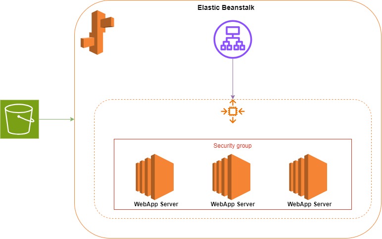

# Deploying a Node.js Application on AWS Elastic Beanstalk using Terraform

## Introduction

This project automates the deployment of a Node.js application on AWS Elastic Beanstalk using Terraform. The deployment involves creating an S3 bucket to store the application bundle, setting up an Elastic Beanstalk application, and configuring an Elastic Beanstalk environment. The project is divided into modules, each responsible for specific tasks, ensuring a modular and reusable Terraform configuration.

## Prerequisites

Before you begin, ensure you have the following:

- [Terraform](https://www.terraform.io/downloads.html) installed
- [AWS CLI](https://aws.amazon.com/cli/) installed and configured
- An AWS account with necessary permissions to create resources
- Your Node.js application code ready to be deployed

## Architecture Overview

The architecture includes the following components:

1. **S3 Bucket**: Creates an S3 Bucket and stores the application code package.
2. **Elastic Beanstalk Application**: Manages the lifecycle of the application versions and environments.
3. **Elastic Beanstalk Environment**: Deploys the Node.js application using Amazon Linux 2023 with Node.js 20 runtime.



## Modules

### S3 Bucket
The S3 bucket module is responsible for creating and managing the S3 bucket that stores your application bundle.

- **Bucket Creation**: Creates an S3 bucket where your application bundle will be stored.
- **Ownership Controls**: Ensures the bucket ownership is controlled by the bucket owner, which is necessary for managing permissions.
- **Access Control**: Sets the bucket's access control list (ACL) to private, ensuring that only the bucket owner has access.
- **Archiving the Application**: Packages your application code into a zip file to be uploaded to S3.
- **Uploading the Application**: Uploads the zipped application bundle to the S3 bucket.

### Elastic Beanstalk Application

The Elastic Beanstalk Application module handles the creation of the Elastic Beanstalk application and its versions.

- **Application Creation**: Creates an Elastic Beanstalk application to manage your application versions.
- **Application Version**: Creates a new version of your application using the application bundle stored in the S3 bucket.

### Elastic Beanstalk Environment

The Elastic Beanstalk Environment module is responsible for creating and configuring the environment where your application will run.

- **IAM Roles**: References existing IAM roles required for the environment to function properly.
- **Environment Creation**: Sets up the Elastic Beanstalk environment using the specified solution stack (Amazon Linux 2023 with Node.js 20) and associates it with the previously created application and its version.

## Setup Instructions

### Clone the Repository

Clone the repository to your local machine:

```sh
git clone https://github.com/ameerahaider/Cloudelligent-Tasks.git
```

```sh
cd Task10
```

### Configure AWS CLI

Ensure your AWS CLI is configured with the necessary profile:

```sh
aws configure
```

### Initialize Terraform

Initialize Terraform in your project directory:

```sh
terraform init
```

### Apply Terraform Configuration

Deploy the infrastructure:

```sh
terraform apply
```

Confirm the changes by typing 'yes' when prompted.

### Outputs
After the deployment, Terraform will output:
- The Enviroment Endpoint to access your application.

### Cleanup

To destroy the resources created by Terraform, run:

```sh
terraform destroy
```

Type 'yes' when prompted to confirm the destruction.