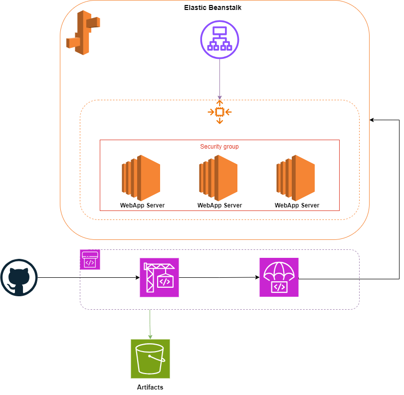

# Deploying a Node.js Application on AWS Elastic Beanstalk using Terraform

## Introduction

This project automates the deployment of a Node.js application on AWS Elastic Beanstalk using Terraform. The deployment involves creating an S3 bucket to store the artifacts, setting up an Elastic Beanstalk application, and configuring an Elastic Beanstalk environment. The project is divided into modules, each responsible for specific tasks, ensuring a modular and reusable Terraform configuration.

## Prerequisites

Before you begin, ensure you have the following:

- [Terraform](https://www.terraform.io/downloads.html) installed
- [AWS CLI](https://aws.amazon.com/cli/) installed and configured
- An AWS account with necessary permissions to create resources
- Your Node.js application code ready to be deployed
- A `buildspec.yml` file is added to the root of the application specifying how to build and package your application. 
- Generate a GitHub Personal Access Token:
  - Go to Settings > Developer settings > Personal access tokens on GitHub.
  - Click Generate new token.
  - Save the token securely.
- Store the Token in AWS Secrets Manager:
  - Log in to the AWS Management Console.
  - Navigate to AWS Secrets Manager and click Store a new secret.
  - Choose Other type of secret and enter GITHUB_OAUTH_TOKEN as the key and your token as the value.
  - Name the secret (e.g., github-oauth-token) and click Store.

## Build Specification File (`buildspec.yml`)

A `buildspec.yml` file is necessary for AWS CodeBuild to understand how to build and package your application. It tells AWS CodeBuild how to build and package your application.

Here’s an example `buildspec.yml` file:

```yaml
version: 0.2

phases:
  install:
    commands:
      - echo Installing dependencies...
      - npm install
artifacts:
  base-directory: '.' # Directory to collect files from
  files:
    - '**/*' # Include all files and subdirectories
```

## Architecture Overview

The architecture includes the following components:

1. **S3 Bucket**: Stores the input and output artifacts from the CodePipeline.
2. **Elastic Beanstalk Application**: Manages the lifecycle of the application versions and environments.
3. **Elastic Beanstalk Environment**: Deploys the Node.js application using Amazon Linux 2023 with Node.js 20 runtime.
4. **IAM Roles**: Provide necessary permissions for ECS tasks, services, Code Build and Code Pipline.
5. **Code Build**: Defines the build stage of the pipeline.
6. **Code Pipeline**: Creates a pipeline that will automate the build, and deployment of your application.



## Modules

### S3 Bucket
The S3 bucket module is responsible for creating and managing the S3 bucket that stores your application bundle.

- **Bucket Creation**: Creates an S3 bucket where your application bundle will be stored.
- **Policies and Permissions**: Allows CodePipeline and CodeBuild to read from and write to the bucket.


### IAM Code Build

The IAM Code Build module provisions:

- **Roles and Policies for AWS CodeBuild**: Allow interaction with other AWS services such as ECR (Elastic Container Registry), S3, and CloudWatch Logs.
  
### IAM Code Pipeline

The IAM Code Pipeline module provisions:

- **Roles and policies for AWS CodePipeline**: Allow access resources needed for the pipeline stages such as access to S3 buckets for reading and writing artifacts. Permissions to interact with CodeBuild for triggering builds. Access to other services such as ECS for deploying the application.
  
### Elastic Beanstalk Application

The Elastic Beanstalk Application module handles the creation of the Elastic Beanstalk application and its versions.

- **Application Creation**: Creates an Elastic Beanstalk application to manage your application versions.

### Elastic Beanstalk Environment

The Elastic Beanstalk Environment module is responsible for creating and configuring the environment where your application will run.

- **IAM Roles**: References existing IAM roles required for the environment to function properly.
- **Environment Creation**: Sets up the Elastic Beanstalk environment using the specified solution stack (Amazon Linux 2023 with Node.js 20).

### Code Build

- **Build Project**: It pulls the source code, runs the build commands, and produces build artifacts. Configured to build specifications (buildspec) to define the build commands and environment.
  
### Code Pipeline

The Code Pipeline module provisions:

- **Code Pipeline**: Creates pipeline which automates the deployment process by integrating various stages such as source, build, and deploy.
- **Source**: Retrieves your code from a source repository (e.g., GitHub).
- **Build**: Uses AWS CodeBuild to compile the code and create deployable artifacts.
- **Deploy**: Deploys the artifacts to your Elastic Beansatlk Enviroment.

## Setup Instructions

### Clone the Repository

Clone the repository to your local machine:

```sh
git clone https://github.com/ameerahaider/Cloudelligent-Tasks.git
```

```sh
cd Task11
```

### Configure AWS CLI

Ensure your AWS CLI is configured with the necessary profile:

```sh
aws configure
```

### Initialize Terraform

Initialize Terraform in your project directory:

```sh
terraform init
```

### Apply Terraform Configuration

Deploy the infrastructure:

```sh
terraform apply
```

Confirm the changes by typing 'yes' when prompted.

### Outputs
After the deployment, Terraform will output:
- The Enviroment Endpoint to access your application.

### Cleanup

To destroy the resources created by Terraform, run:

```sh
terraform destroy
```

Type 'yes' when prompted to confirm the destruction.