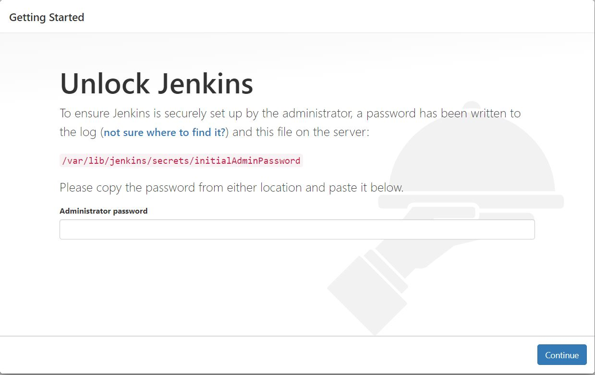

# Jenkins Agent Setup and ECS Deployment Pipeline

This guide explains how to set up a Jenkins agent on an AWS EC2 instance, configure AWS CLI with SSO, create the necessary AWS infrastructure, and set up a Jenkins pipeline that deploys a Dockerized application from GitHub to AWS ECS. It also includes instructions on how to trigger the Jenkins pipeline.

## Prerequisites

Make sure you have the following ready before you begin:

- **AWS Account**: You will need an active AWS account to create and manage resources.
- **GitHub Repository**: A GitHub repository that contains the Dockerized application you want to deploy. If not, you can use this [Simple Web Application](https://github.com/ameerahaider/simple-web-app).
- **ECR and ECS Setup**: Your AWS Elastic Container Registry (ECR) and Elastic Container Service (ECS) infrastructure should already be in place. If not, you can set it up following the [guide](https://github.com/ameerahaider/Cloudelligent-Tasks/tree/main/Task7).


## 1. Setting Up Jenkins Agent on an EC2 Instance

### 1.1 Create a Key Pair

A key pair allows secure SSH access to your EC2 instance.

1. Log into your **AWS Management Console**.
2. Go to **EC2** > **Key Pairs**.
3. Click **Create key pair**. Download the `.pem` file, which will be used to SSH into your EC2 instance.

This file should be kept safe as it is the only way to securely access your instance.

### 1.2 Create a Security Group

A security group acts as a firewall, determining what traffic can come in and out of your EC2 instance.

1. In the **EC2 console**, go to **Security Groups** and click **Create Security Group**.
2. Configure the **Inbound Rules**:
   - **SSH (Port 22)**: Allows you to connect via SSH from your IP address.
   - **HTTP (Port 80)**: Enables access to your Jenkins server from any browser.
   - **Custom TCP Rule (Port 8080)**: Jenkins runs on port 8080 by default. Open this port to allow web access to Jenkins from any IP address.

### 1.3 Create an IAM Role for EC2

This role gives your EC2 instance the permissions to interact with AWS services such as ECR and ECS.

1. Go to the **IAM** service in the AWS Console.
2. Create a **new IAM role** with the following AWS managed policies:
   - **AmazonEC2ContainerRegistryFullAccess**: Full access to ECR (Elastic Container Registry).
   - **AmazonECS_FullAccess**: Full access to ECS (Elastic Container Service).

This role will be attached to your EC2 instance.

### 1.4 Launch an EC2 Instance

1. In the **EC2 Console**, click **Launch Instance**.
2. Choose the following configurations:
   - **Amazon Machine Image (AMI)**: Choose **Ubuntu 24.04 LTS**.
   - **Instance Type**: `t2.micro` (free tier eligible).
   - **Key Pair**: Select the key pair you created earlier.
   - **Security Group**: Select the security group created in step 1.2.
   - **IAM Role**: Select the role created in step 1.3.
3. Launch the instance.

You will use this EC2 instance as a Jenkins agent.


### 1.5 Install Jenkins, AWS CLI, and Docker on EC2

Once your EC2 instance is up and running, connect to it using SSH. Then install Jenkins, AWS CLI, and Docker.

#### SSH into Your Instance

Use the following command to connect to your EC2 instance (replace `<path_to_pem_file>`, `<ec2-user>`, and `<instance_public_dns>` with your actual values):

```bash
ssh -i <path_to_pem_file>.pem ubuntu@<instance_public_dns>
```

#### Install Jenkins

1. Install OpenJDK (required for Jenkins):

```bash
sudo apt update
sudo apt install openjdk-17-jdk -y
```

2. Install Jenkins:

```bash
curl -fsSL https://pkg.jenkins.io/debian-stable/jenkins.io-2023.key | sudo tee /usr/share/keyrings/jenkins-keyring.asc > /dev/null
echo deb [signed-by=/usr/share/keyrings/jenkins-keyring.asc] https://pkg.jenkins.io/debian-stable binary/ | sudo tee /etc/apt/sources.list.d/jenkins.list > /dev/null
sudo apt update
sudo apt install jenkins -y
sudo systemctl start jenkins
sudo systemctl enable jenkins
```

3. Confirm Jenkins is running:

```bash
sudo systemctl status jenkins
```


#### Install AWS CLI

Install the AWS Command Line Interface (CLI), which Jenkins will use to interact with AWS services:

```bash
sudo apt install curl unzip -y
curl "https://awscli.amazonaws.com/awscli-exe-linux-x86_64.zip" -o "awscliv2.zip"
unzip awscliv2.zip
sudo ./aws/install
sudo aws --version
```


#### Install Docker

Docker is required to build and push Docker images:

```bash
sudo apt install docker.io -y
sudo systemctl start docker
sudo usermod -aG docker $USER
sudo usermod -aG docker jenkins
sudo systemctl status docker
```


### 1.6 Configure AWS CLI with SSO

If your organization uses AWS SSO (Single Sign-On), configure the AWS CLI:

```bash
aws configure sso
```

Follow the prompts to authenticate using your SSO portal.

If you’re not using SSO, you can configure the AWS CLI with access keys instead:

```bash
aws configure
```

### Set Your Profile as Default

After configuring the AWS CLI, you can set the profile as default by modifying the AWS CLI configuration files manually.

1. **Open the AWS CLI Configuration File:**

   Open your AWS configuration file located at `~/.aws/config` using a text editor like `nano`:

   ```bash
   nano ~/.aws/config
   ```

2. **Modify the File:**

   Find the profile you just created (it might be named `AWSAdministratorAccess-905418229977` or something similar) and update it to be the default profile. 

   Add or modify the following lines in the file:

   ```ini
   [default]
   sso_start_url = https://your-sso-portal-url
   sso_region = us-east-1
   sso_account_id = 123456789012
   sso_role_name = YourSSORole
   region = us-east-1
   output = json
   ```

   Replace the placeholders with your actual SSO settings and desired default region.

   **For Access Key Configuration:**

   If you used `aws configure` instead, your `~/.aws/config` might look like this:

   ```ini
   [default]
   aws_access_key_id = YOUR_ACCESS_KEY_ID
   aws_secret_access_key = YOUR_SECRET_ACCESS_KEY
   region = us-east-1
   output = json
   ```

3. **Save and Exit:**

   Save the changes in `nano` by pressing `Ctrl + O`, then exit by pressing `Ctrl + X`.

4. **Verify the Default Profile:**

   You can verify that the default profile is set by running:

   ```bash
   aws sts get-caller-identity
   ```

   This command should return details about the AWS account associated with the default profile, confirming that your configuration is correct.

### 1.7 Configure Jenkins

1. Open your browser and navigate to `http://<instance_public_dns>:8080`.
   


2. Retrieve the initial Jenkins admin password by running:

```bash
sudo cat /var/lib/jenkins/secrets/initialAdminPassword
```

3. Follow the setup wizard, install suggested plugins, and create the admin user.
   


4. Go to **Manage Jenkins** > **Manage Plugins** and install the following plugins:
   - **GitHub Integration Plugin**
   - **Docker Plugin**
   - **Amazon EC2 Plugin**

## 2. Setting Up a Webhook in GitHub

A webhook allows Jenkins to automatically trigger a build whenever you push code to your GitHub repository.

1. Go to your **GitHub repository** > **Settings** > **Webhooks**.
2. Click **Add webhook** and fill in the following details:
   - **Payload URL**: `http://<your_jenkins_url>/github-webhook/`.
   - **Content type**: `application/json`.
   - **Which events would you like to trigger this webhook?**: Choose **Just the push event**.


## 3. Creating a Jenkins Pipeline

The Jenkins pipeline automates the process of building a Docker image, pushing it to Amazon ECR, and deploying it to ECS.

### 3.1 Install Necessary Plugins

Ensure you have the **GitHub Integration** and **Docker** plugins installed.

### 3.2 Creating a Pipeline Job

1. In Jenkins, click **New Item** > **Pipeline** and name your project (e.g., `ECS-Deployment-Pipeline`).
2. Under **Pipeline** configuration, select **Pipeline script**.
3. Paste the following pipeline script:

```groovy
pipeline {
    agent any
    environment {
        AWS_REGION = ''
        ECR_REPOSITORY_URI = ''
        IMAGE_TAG = "latest"
        GIT_REPO_URL = ''
        ECS_CLUSTER = ''
        ECS_SERVICE = ''
        TASK_DEFINITION_FAMILY = ''
    }
    stages {
        stage('Checkout Code') {
            steps {
                // Clone the repository
                git branch: 'main', url: "${env.GIT_REPO_URL}"
            }
        }
        stage('Login to AWS ECR') {
            steps {
                // Authenticate Docker to the ECR registry
                sh 'aws ecr get-login-password --region $AWS_REGION | docker login --username AWS --password-stdin $ECR_REPOSITORY_URI'
            }
        }
        stage('Build Docker Image') {
            steps {
                // Build the Docker image
                sh 'docker build -t $ECR_REPOSITORY_URI:$IMAGE_TAG .'
            }
        }
        stage('Push Docker Image to ECR') {
            steps {
                // Push the image to the ECR repository
                sh 'docker push $ECR_REPOSITORY_URI:$IMAGE_TAG'
            }
        }
        stage('Deploy to ECS') {
            steps {
                // Update the ECS service with the new Docker image
                sh '''
                aws ecs update-service --cluster $ECS_CLUSTER --service $ECS_SERVICE --force-new-deployment --region $AWS_REGION
                '''
            }
        }
    }
}
```

### Pipeline Explanation

- **Pipeline Script**: Automates the tasks that Jenkins will perform.
- **Stages**:
  1. **Checkout Code**: Clones the application code from the GitHub repository.
  2. **Login to AWS ECR**: Jenkins authenticates to Amazon Elastic Container Registry (ECR) to push the Docker image.
  3. **Build Docker Image**: Builds a Docker image from the checked-out code.
  4. **Push Docker Image to ECR**: Pushes the newly built image to Amazon ECR.
  5. **Deploy to ECS**: Updates the ECS service to deploy the new Docker image.

## 4. Triggering and Verifying the Jenkins Pipeline

### 4.1 Triggering the Pipeline

There are two methods to trigger the pipeline:

1. **Automatic Trigger (Webhook)**:
   - If you set up the GitHub webhook in Section 2, the Jenkins pipeline will automatically start when you push new code to the GitHub repository.
   - To test this:
     1. Make a change to your code and push it to the GitHub repository.
     2. Navigate to the Jenkins dashboard, and you should see the pipeline starting automatically.
   
    

2. **Manual Trigger**:
   - You can manually run the pipeline:
     1. Go to your Jenkins dashboard.
     2. Select the pipeline project (e.g., **ECS-Deployment-Pipeline**).
     3. Click **Build Now** to manually trigger the pipeline.
   
   

### 4.2 Verifying the Jenkins Pipeline Run

After triggering the pipeline, you can verify each stage's execution to ensure successful deployment:

1. **View Build Progress**:
   - Go to the Jenkins dashboard and click on your pipeline project.
   - Under **Build History**, click on the current build number to open the build details.
   - Select **Console Output** to view the real-time logs for each pipeline stage. This will show:
     - The code checkout process.
     - Docker image build status.
     - Authentication to ECR.
     - Docker image push to ECR.
     - ECS service deployment.
  
    

2. **Verify ECS Service Deployment**:
   - In the AWS Management Console, go to **ECS** (Elastic Container Service).
   - Select your cluster, then the service (**app**).
   - Under the **Tasks** tab, ensure that new tasks have been launched with the updated Docker image. The **Last Status** should indicate that the task is **RUNNING**.
   - You can also click on a running task to view its logs and details.
  
    

1. **Test the Application**:
   - After the ECS service is updated, your application should be accessible through the Application Load Balancer (if configured).
   - Open the URL of your ALB (or public IP of your EC2 instance if directly accessible) in a browser to confirm that the updated application is running successfully.

By following these steps, you'll ensure that the pipeline runs correctly and that the application is deployed and functioning as expected on ECS.

## 5. Cleanup

After verifying that your Jenkins pipeline works as expected and your application is successfully deployed, you may want to clean up the resources to avoid incurring unnecessary costs. Follow these steps to clean up:

### 5.1 Delete the EC2 Instance

**Terminate the EC2 Instance**:
 - Once the instance is stopped, select it again and click **Instance State** > **Terminate Instance**.
 - Confirm that you want to terminate the instance.

### 5.2 Delete the Security Group

1. **Go to Security Groups**:
   - In the **EC2 Dashboard**, navigate to **Security Groups**.

2. **Delete the Security Group**:
   - Find the security group created for the Jenkins instance.
   - Select it and click **Actions** > **Delete Security Group**.
   - Confirm that you want to delete the security group.

### 5.3 Delete the IAM Role

1. **Go to IAM Roles**:
   - In the **IAM Dashboard**, navigate to **Roles**.

2. **Delete the IAM Role**:
   - Find the IAM role created for the EC2 instance.
   - Select it and click **Delete Role**.
   - Confirm that you want to delete the role.

### 5.4 Delete the ECR and ECS Infrastructure

**Using Terraform**:
If you provisioned your ECR and ECS infrastructure using Terraform, you can clean up all resources by running:
  
```bash
terraform destroy
```

This command will remove all resources defined in your Terraform configuration files. Make sure you are in the correct directory where your Terraform configuration files are located before running the command.

### 5.6 Delete the GitHub Webhook

1. **Go to Your GitHub Repository**:
   - Navigate to the **Settings** > **Webhooks** section.

2. **Delete the Webhook**:
   - Find the webhook created for Jenkins.
   - Click **Delete** next to the webhook.