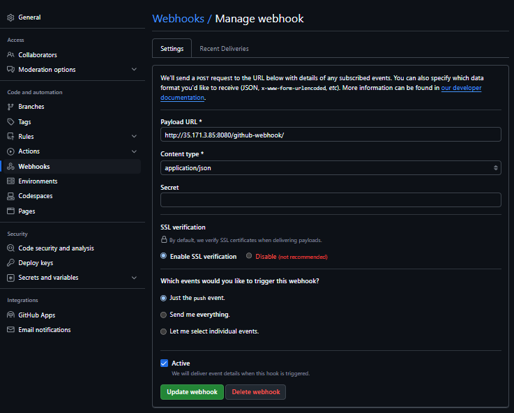
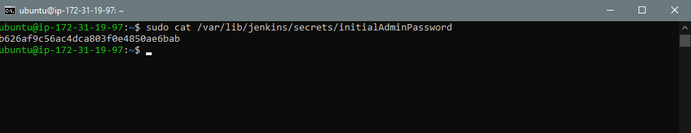
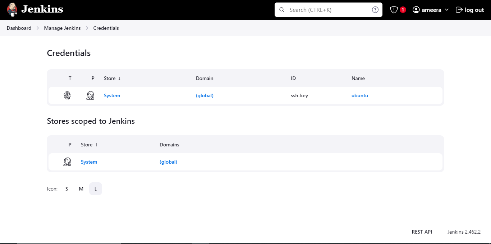
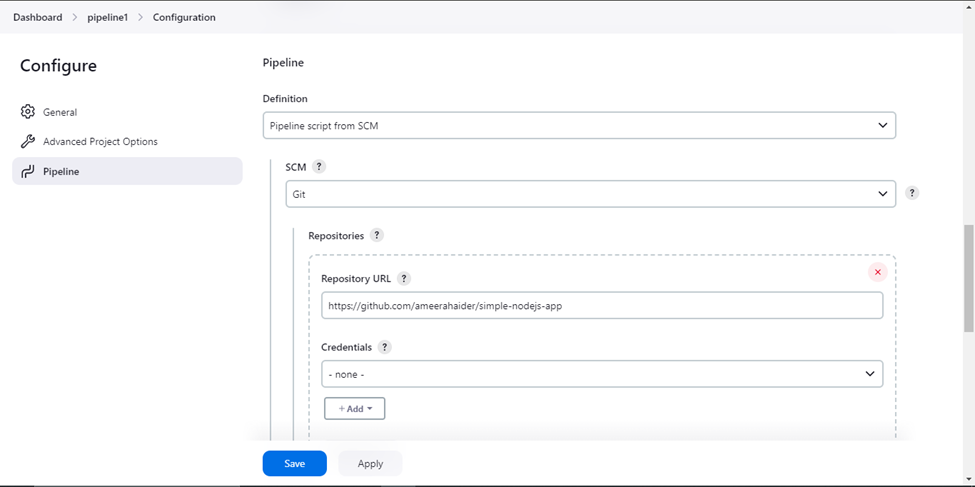
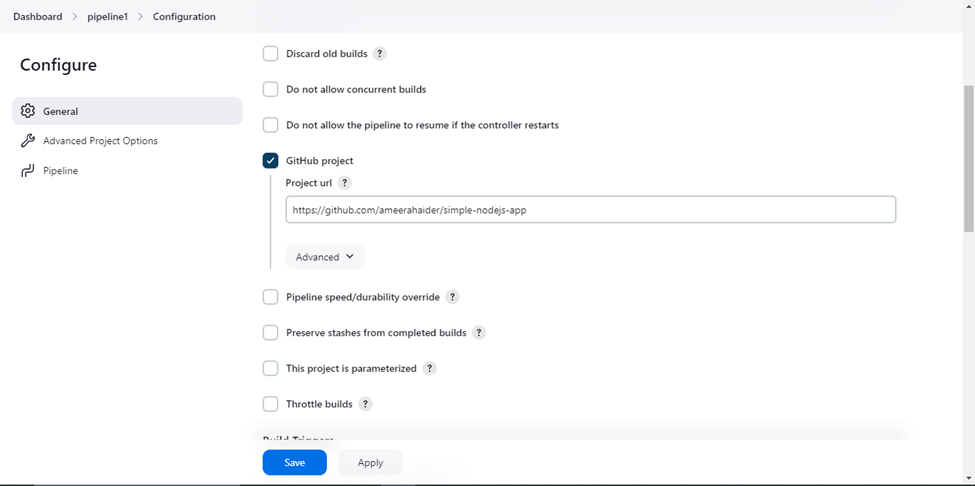
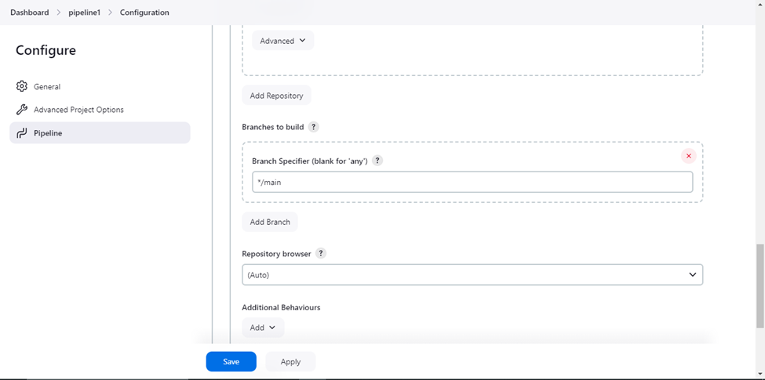
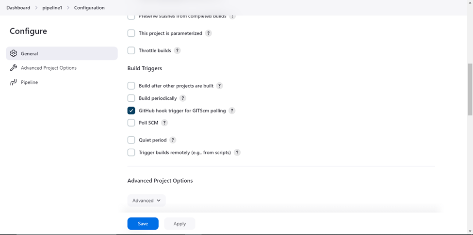
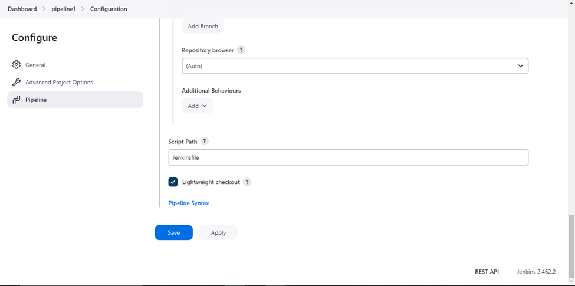

# Deploying a NodeJS App on EC2 Instance Using Terraform and Scripted Jenkins Pipeline

This guide provides detailed instructions on setting up a Jenkins agent on an AWS EC2 instance, configuring AWS CLI with SSO, creating necessary AWS infrastructure using Terraform, and setting up a Jenkins pipeline to deploy a Dockerized application from GitHub to AWS EC2. Additionally, it covers how to trigger the Jenkins pipeline.


## Introduction

This guide aims to walk you through deploying a NodeJS application to an EC2 instance using Terraform and Jenkins. We will cover the entire process from setting up the infrastructure with Terraform, configuring Jenkins, and creating a Jenkins pipeline to automate the deployment of your application.

## Prerequisites

Before you start, ensure you have the following:

- [Terraform](https://www.terraform.io/downloads.html) installed on your local machine.
- An **AWS Account** for managing AWS resources.
- A **GitHub Repository** containing your application. If you don’t have one, you can use this [Simple NodeJS Application](https://github.com/ameerahaider/simple-nodejs-app).

## Terraform Setup

### 1.1 Architecture Overview

The architecture includes the following components:

1. **Security Groups**: Define access rules for the EC2 instances (Jenkins and Application).
2. **EC2 Instances**: 
   - One instance to host the application.
   - One instance to run the Jenkins agent.
3. **IAM Roles**: Grant necessary permissions for EC2 access.

### 1.2 Modules

The Terraform modules you will use include:

- **EC2 Module**: For provisioning EC2 instances.
- **Security Groups Module**: For defining security rules.
- **IAM Roles Module**: For setting up required IAM roles.

### 1.3 Setup Instructions

#### Clone the Repository

First, clone the repository to your local machine:

```sh
git clone https://github.com/ameerahaider/Cloudelligent-Tasks.git
```

Navigate to the project directory:

```sh
cd Task14
```

#### Configure AWS CLI

Ensure your AWS CLI is configured with the necessary profile:

```sh
aws configure
```

#### Initialize Terraform

Initialize Terraform in your project directory:

```sh
terraform init
```

#### Apply Terraform Configuration

Deploy the infrastructure by applying the Terraform configuration:

```sh
terraform apply
```

Confirm the changes by typing 'yes' when prompted.

#### Outputs

After deployment, Terraform will provide the following outputs:
- The IP address to access your application.
- The IP address to access your Jenkins Agent.

## Jenkins Configuration

### 2.1 Adding Jenkinsfile to GitHub

Add the following Jenkinsfile to your GitHub repository:

```groovy
node {
    // Define environment variables
    def GIT_REPO_URL = '<git_app_url>'
    def EC2_SSH_CREDENTIALS_ID = 'ssh-key'
    def EC2_INSTANCE_IP = '<instance_public_dns>'
    def APP_PATH = '/home/ubuntu'

    // Stage: Clone Repository
    stage('Clone Repository') {
        try {
            git branch: 'main', url: GIT_REPO_URL
        } catch (Exception e) {
            error "Failed to clone repository: ${e.getMessage()}"
        }
    }

    // Stage: Verify SSH Connectivity
    stage('Verify SSH Connectivity') {
        withCredentials([sshUserPrivateKey(credentialsId: EC2_SSH_CREDENTIALS_ID, keyFileVariable: 'SSH_KEY')]) {
            sh """
                echo "Verifying SSH connection to EC2 instance..."
                ssh -o StrictHostKeyChecking=no -i $SSH_KEY ubuntu@${EC2_INSTANCE_IP} 'echo "SSH connection successful!"'
            """
        }
    }

    // Stage: Create App Directory
    stage('Create App Directory') {
        withCredentials([sshUserPrivateKey(credentialsId: EC2_SSH_CREDENTIALS_ID, keyFileVariable: 'SSH_KEY')]) {
            sh """
                echo "Creating directory for application..."
                ssh -o StrictHostKeyChecking=no -i $SSH_KEY ubuntu@${EC2_INSTANCE_IP} "mkdir -p ${APP_PATH}"
            """
        }
    }

    // Stage: Copy Files to EC2
    stage('Copy Files to EC2') {
        withCredentials([sshUserPrivateKey(credentialsId: EC2_SSH_CREDENTIALS_ID, keyFileVariable: 'SSH_KEY')]) {
            sh """
                echo "Copying files to EC2 instance..."
                echo "Files in workspace:"
                ls -l

                scp -o StrictHostKeyChecking=no -i $SSH_KEY -r * ubuntu@${EC2_INSTANCE_IP}:${APP_PATH}
            """
        }
    }

    // Stage: Run Deployment Commands
    stage('Run Deployment Commands') {
        withCredentials([sshUserPrivateKey(credentialsId: EC2_SSH_CREDENTIALS_ID, keyFileVariable: 'SSH_KEY')]) {
            sh """
                echo "Running commands on EC2 instance..."
                ssh -o StrictHostKeyChecking=no -i $SSH_KEY ubuntu@${EC2_INSTANCE_IP} "
                    cd ${APP_PATH}
                    npm install
                    nohup npm start &> app.log &
                "
            """
        }
    }

    // Always clean workspace
    cleanWs()
}
```

### 2.2 Setting Up a Webhook in GitHub

To enable Jenkins to trigger a build automatically on code changes:

1. Navigate to your **GitHub repository** > **Settings** > **Webhooks**.
2. Click **Add webhook** and fill in the following details:
   - **Payload URL**: `http://<your_jenkins_url>/github-webhook/`
   - **Content type**: `application/json`
   - **Which events would you like to trigger this webhook?**: Choose **Just the push event**



### 2.3 Configuring Jenkins Agent on EC2 Instance

#### Configure Jenkins

1. Open your browser and navigate to `http://<instance_public_dns>:8080`.
   
2. Retrieve the initial Jenkins admin password:

```bash
sudo cat /var/lib/jenkins/secrets/initialAdminPassword
```



3. Follow the setup wizard, install suggested plugins, and create an admin user.

4. Go to **Manage Jenkins** > **Manage Plugins** and install the following plugins:
   - **GitHub Integration Plugin**
   - **Amazon EC2 Plugin**

5. Go to **Manage Jenkins** > **Manage Credentials** and add your SSH Key for accessing the EC2 instance.
   - You will be prompted to select a domain. If you haven’t set up any domains, choose (global) to add credentials for the entire Jenkins instance.
   - Click on Add Credentials on the left side.
   - In the Kind dropdown, select SSH Username with private key.
   - Username: Enter ubuntu (or the username used for your EC2 instance).
   - Private Key: Select Enter directly and paste your private key. Ensure this key matches the one used for SSH access to the EC2 instance.
   - ID: Provide an identifier for this credential, such as ec2-ssh-key.
   - Description: Optionally, add a description for easy identification, e.g., SSH Key for EC2.



### 2.4 Creating a Jenkins Pipeline

#### Creating a Pipeline Job

1. **Create a New Pipeline Job**:
   
   - From the Jenkins dashboard, click **New Item** on the left-hand menu.

2. **Name and Select Job Type**:
   
   - Enter a name for your pipeline job in the Item name field.
   - Select **Pipeline** as the job type.
   - Click **OK** to proceed.

3. **Configure Pipeline Job**:

   - **General Tab**: Optionally, you can configure job descriptions, restrict where the project can be run, etc.
   - **Pipeline Tab**:
     1. **Definition**:
   
        - Select Pipeline script from SCM from the Definition dropdown menu.
  
     2. **SCM Configuration**:
   
        - **SCM**: Select Git from the SCM dropdown.
        - **Repository URL**: Enter the URL of your GitHub repository containing the Jenkinsfile (e.g., https://github.com/yourusername/your-repo.git).
        - **Credentials**: If your repository is private, select the SSH credentials you added earlier.
        - **Branches to build**: Enter main or the branch name where your Jenkinsfile is located.
  
     3. **Script Path**:
   
        - **Script Path**: Enter the path to your Jenkinsfile in the repository (e.g., Jenkinsfile).

4. **Configure Build Triggers**:
   - **Build Triggers Tab**:
     - To enable Git SCM polling, check **GitHub hook trigger for GITScm polling**.

5. **Save and Apply**:
   - Click Save to apply the configuration and create the pipeline job.







## Triggering and Verifying the Jenkins Pipeline

### 3.1 Automatic Trigger (Webhook)

If you set up the GitHub webhook:

1. Make a change to your code and push it to the GitHub repository.
2. Navigate to the Jenkins dashboard to see the pipeline starting automatically.

### 3.2 Manual Trigger

To manually run the pipeline:

1. Go to your Jenkins dashboard.
2. Select the pipeline project.
3. Click **Build Now** to start the pipeline manually.

## Cleanup

After confirming that your Jenkins pipeline works as expected and your application is deployed, you might want to clean up resources to avoid incurring additional costs. Follow these steps to clean up:

1. **Terminate EC2 Instances**: Delete the EC2 instances created for Jenkins and your application.
2. **Remove Terraform Resources**: Run `terraform destroy` to remove all Terraform-managed resources.
3. **Delete GitHub Webhook**: Remove the webhook configuration from your GitHub repository if no longer needed.

By following these steps, you will successfully deploy a Dockerized application on an EC2 instance using Terraform and Jenkins, and have a clean setup ready for future use.