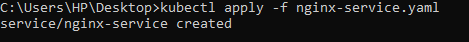

# Deploying a Simple Application on AWS EKS

This guide provides step-by-step instructions for deploying a simple Nginx application on AWS Elastic Kubernetes Service (EKS). It includes setting up the EKS cluster, configuring `kubectl`, and deploying the application manually. Follow these steps to complete the deployment.

---

## Prerequisites

Before you start, ensure you have the following:

1. **AWS Account**: [Sign up for an AWS account](https://aws.amazon.com/) if you don’t have one.
2. **IAM User**: Create an IAM user with permissions to manage EKS, EC2, and networking services. Use the `AdministratorAccess` policy for simplicity in this guide.
3. **AWS CLI**: [Install the AWS CLI](https://aws.amazon.com/cli/) for interacting with AWS services.
4. **kubectl**: [Install kubectl](https://kubernetes.io/docs/tasks/tools/install-kubectl-windows/) for managing Kubernetes clusters.

---

## Step 1: Create an EKS Cluster

### 1.1. Create an EKS Role

1. **Navigate to IAM Console**:
   - Go to the [IAM Management Console](https://console.aws.amazon.com/iam/).
   - Create a new role with **EKS** as the trusted entity type.
   - Attach the policies `AmazonEKSClusterPolicy` and `AmazonEKSServicePolicy`.
   - Name the role `EKS-ClusterRole`.

        

### 1.2. Create a VPC for EKS

EKS requires a VPC to run. You can create a VPC using the AWS Management Console or the AWS CLI.

**Using AWS CLI:**

```bash
aws cloudformation create-stack --stack-name eks-vpc --template-url https://amazon-eks.s3.us-west-2.amazonaws.com/cloudformation/2020-06-10/amazon-eks-vpc-sample.yaml
```


### 1.3. Create the EKS Cluster

1. **Go to the Amazon EKS Console**:
   - Navigate to the [Amazon EKS Console](https://console.aws.amazon.com/eks/home) and click **Create Cluster**.
   - Provide the cluster details:
     - **Cluster Name**: `my-cluster`
     - **Kubernetes Version**: Select a version (e.g., 1.23).
     - **Cluster Role**: Choose the role created (`EKS-ClusterRole`).

        

2. **Networking**:
   - Choose the VPC created earlier.
   - Select public and private subnets.
   - Choose the appropriate security group.

        

3. **Create the Cluster**:
   - Review and create the cluster. This process will take around 10-15 minutes.

        

---

## Step 2: Configure kubectl to Connect to EKS

1. **Update kubeconfig**:
   - Run the following command to configure `kubectl`:

     ```bash
     aws eks --region <your-region> update-kubeconfig --name my-cluster
     ```

        

2. **Verify Connection**:
   - Check the services running in your cluster:

     ```bash
     kubectl get svc
     ```

        
---

## Step 3: Create Worker Nodes

### 3.1. Create an EKS Node Group Role

1. **Navigate to IAM Console**:
   - Create a role with the following policies:
     - `AmazonEKSWorkerNodePolicy`
     - `AmazonEC2ContainerRegistryReadOnly`
     - `AmazonEKS_CNI_Policy`
   - Name the role `EKS-NodeRole`.

        

### 3.2. Create an EC2 Key Pair

1. **Navigate to EC2 Console**:
   - Go to the [EC2 Console](https://console.aws.amazon.com/ec2/v2/home).
   - Create a new key pair and download it to your machine.

### 3.3. Create a Node Group

1. **Add Node Group in EKS Console**:
   - In the [EKS Console](https://console.aws.amazon.com/eks/home), go to **Compute** > **Add Node Group**.
   - Provide the details:
     - **Name**: `node-group`
     - **Node IAM Role**: Select `EKS-NodeRole`.
     - **Subnets**: Choose the subnets from your VPC.
     - **Instance Type**: Select instance type (e.g., `t3.medium`).
     - **Key Pair**: Select the key pair you created.

        
        
        
        
        

2. **Create Node Group**:
   - Click **Create**. This will create the node group, which can take a few minutes.

        
---

## Step 4: Deploy Nginx Application

1. **Create a Deployment YAML File**:

    Save the following content in `nginx-deployment.yaml`:

    ```yaml
    apiVersion: apps/v1
    kind: Deployment
    metadata:
      name: nginx-deployment
    spec:
      replicas: 2
      selector:
        matchLabels:
          app: nginx
      template:
        metadata:
          labels:
            app: nginx
        spec:
          containers:
          - name: nginx
            image: nginx:latest
            ports:
            - containerPort: 80
    ```

2. **Deploy the Application**:

    ```bash
    kubectl apply -f nginx-deployment.yaml
    ```

    

3. **Verify the Deployment**:

    ```bash
    kubectl get deployments
    ```

    

---

## Step 5: Expose Nginx via LoadBalancer

1. **Create a Service YAML File**:

    Save the following content in `nginx-service.yaml`:

    ```yaml
    apiVersion: v1
    kind: Service
    metadata:
      name: nginx-service
    spec:
      selector:
        app: nginx
      ports:
      - protocol: TCP
        port: 80
        targetPort: 80
      type: LoadBalancer
    ```

2. **Deploy the Service**:

    ```bash
    kubectl apply -f nginx-service.yaml
    ```

    

3. **Get the External IP**:

    ```bash
    kubectl get svc nginx-service
    ```

    Wait for a few minutes to get the external IP.

    

---

## Step 6: Access Nginx Application

1. **Access the Application**:
   - Open a browser and navigate to the external IP obtained in the previous step. You should see the Nginx welcome page.

        

---

## Step 7: Clean Up Resources

1. **Delete the Service**:

    ```bash
    kubectl delete svc nginx-service
    ```

2. **Delete the Deployment**:

    ```bash
    kubectl delete deployment nginx-deployment
    ```

3. **Delete the EKS Cluster and Node Group**:
   - Go to the EKS Console and delete the cluster and associated resources.

---