# Monitoring EC2 Instances with Prometheus and Grafana

This tutorial guides you through installing Prometheus and Grafana on a Windows machine to monitor an EC2 instance running a simple application (e.g., Nginx) and collect metrics using Node Exporter.

## Table of Contents
1. [Prerequisites](#prerequisites)
2. [Step 1: Install Prometheus on Windows](#step-1-install-prometheus-on-windows)
3. [Step 2: Install Grafana on Windows](#step-2-install-grafana-on-windows)
4. [Step 3: Set Up Your EC2 Instance](#step-3-set-up-your-ec2-instance)
5. [Step 4: Install Node Exporter on EC2](#step-4-install-node-exporter-on-ec2)
6. [Step 5: Configure Security Groups](#step-5-configure-security-groups)
7. [Step 6: Configure Prometheus to Scrape Metrics](#step-6-configure-prometheus-to-scrape-metrics)
8. [Step 7: Add Prometheus Data Source in Grafana](#step-7-add-prometheus-data-source-in-grafana)
9. [Step 8: Create Panels for Visualizations](#step-8-create-panels-for-visualizations)
10. [Step 9: Organize Your Dashboard](#step-9-organize-your-dashboard)
11. [Step 10: (Optional) Set Up Alerts in Grafana](#step-10-optional-set-up-alerts-in-grafana)

## Prerequisites
- A Windows machine for installing Prometheus and Grafana.
- An AWS account to launch and configure an EC2 instance.
- Basic understanding of command line usage and SSH.

---

## Step 1: Install Prometheus on Windows

### Download Prometheus
1. Go to the [Prometheus downloads page](https://prometheus.io/download/).
2. Under "Prometheus," find the Windows version and download the `.zip` file.

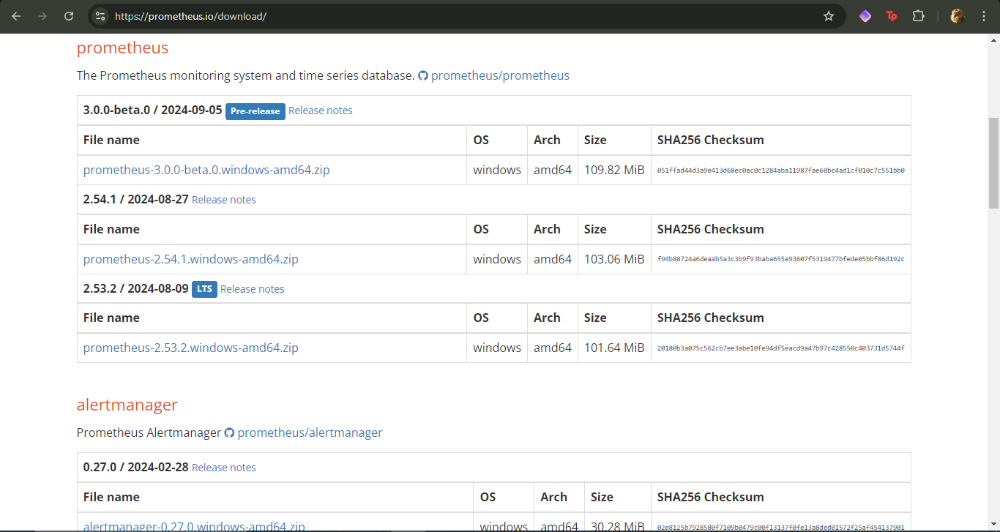

### Extract the Files
1. Extract the `.zip` file to a folder, e.g., `C:\prometheus`.

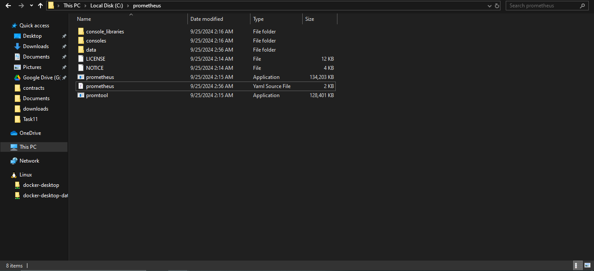

### Configure Prometheus
1. Inside the Prometheus folder, locate the `prometheus.yml` configuration file.
2. For now, you can leave the default configuration as is. This file tells Prometheus which targets to scrape for metrics.

### Run Prometheus
1. Open Command Prompt or PowerShell.
2. Navigate to the Prometheus directory:
   ```bash
   cd C:\prometheus
   ```
3. Run Prometheus:
   ```bash
   prometheus.exe --config.file=prometheus.yml
   ```

   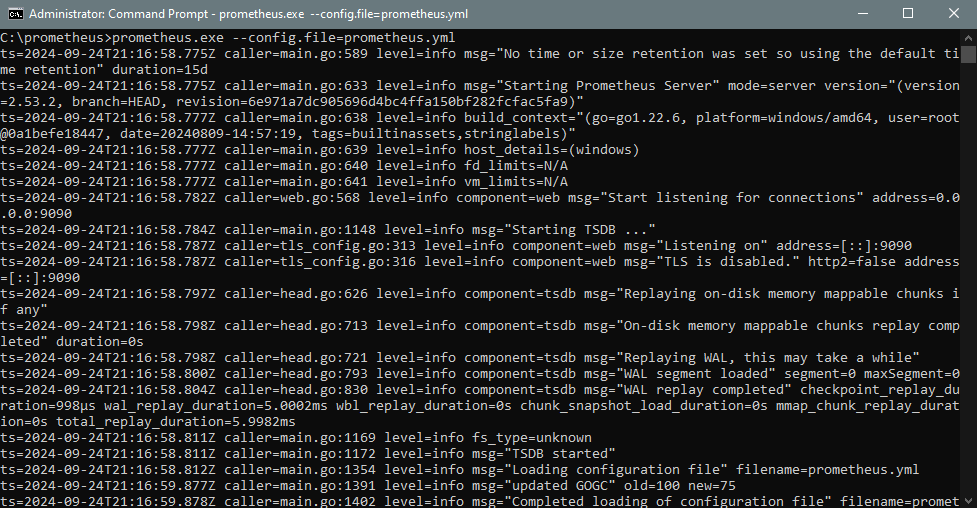

4. Prometheus will start running on `http://localhost:9090`. Visit this address in your web browser to access the Prometheus interface.

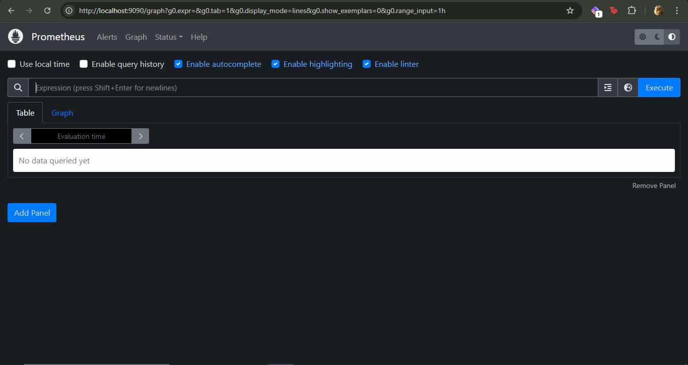

---

## Step 2: Install Grafana on Windows

### Download Grafana
1. Go to the [Grafana downloads page](https://grafana.com/grafana/download).
2. Download the Windows installer `.msi` file.

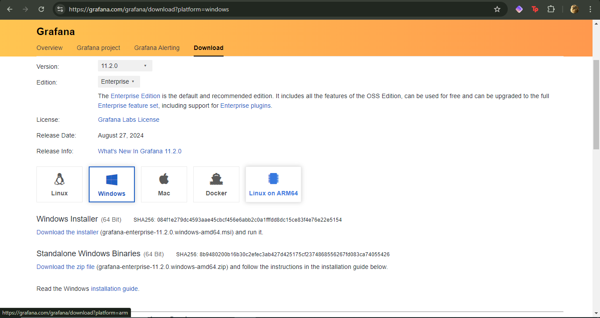

### Install Grafana
1. Run the installer and follow the installation instructions.
2. Once installed, Grafana will automatically run as a service.

### Access Grafana
1. Open your browser and go to `http://localhost:3000`.
2. The default login credentials are:
   - Username: `admin`
   - Password: `admin`
3. You will be prompted to change the password upon the first login.

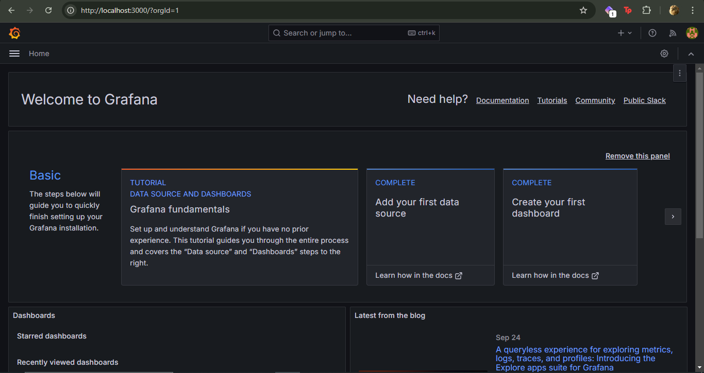

---

## Step 3: Set Up Your EC2 Instance

### Launch an EC2 Instance
1. Go to the AWS Management Console.
2. Launch a new EC2 instance (e.g., Amazon Linux 2 or Ubuntu), ensuring it is accessible over the internet.
3. Ensure you open the necessary ports:
   - Port `9100` for Node Exporter.
   - Port `80` or `3000` for the application you're running.

### Install Your Simple Application
1. SSH into your EC2 instance.
2. Install the application (e.g., Nginx) with the following commands:
   ```bash
   sudo yum update -y
   sudo amazon-linux-extras install nginx1.12 -y
   sudo systemctl start nginx
   sudo systemctl enable nginx
   ```

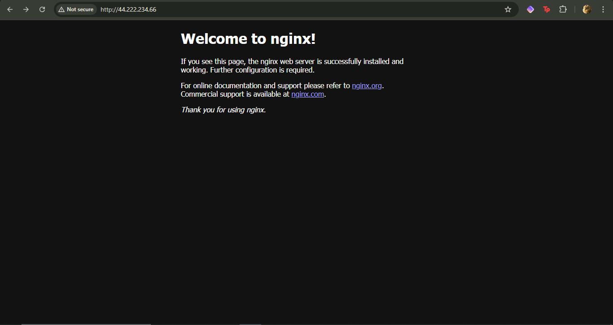

---

## Step 4: Install Node Exporter on EC2

Node Exporter is a Prometheus exporter that collects metrics from the EC2 instance.

### Download Node Exporter
1. SSH into your EC2 instance and run:
   ```bash
   wget https://github.com/prometheus/node_exporter/releases/download/v1.6.1/node_exporter-1.6.1.linux-amd64.tar.gz
   ```

### Extract the Downloaded File
```bash
tar -xvzf node_exporter-1.6.1.linux-amd64.tar.gz
```

### Move the Node Exporter Binary
```bash
sudo mv node_exporter-1.6.1.linux-amd64/node_exporter /usr/local/bin/
```

### Create a Systemd Service for Node Exporter
1. Create a new systemd service file:
   ```bash
   sudo nano /etc/systemd/system/node_exporter.service
   ```
2. Add the following content:
   ```ini
   [Unit]
   Description=Node Exporter
   After=network.target

   [Service]
   User=nobody
   ExecStart=/usr/local/bin/node_exporter

   [Install]
   WantedBy=default.target
   ```

### Start and Enable Node Exporter
```bash
sudo systemctl daemon-reload
sudo systemctl start node_exporter
sudo systemctl enable node_exporter
```

### Verify Node Exporter is Running
Node Exporter runs on port `9100` by default. Check by visiting:
```
http://<your-ec2-instance-public-ip>:9100/metrics
```
or using `curl`:
```bash
curl http://localhost:9100/metrics
```

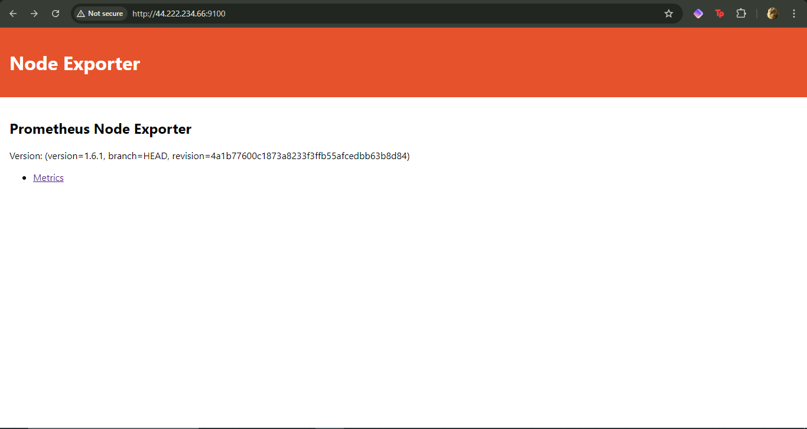

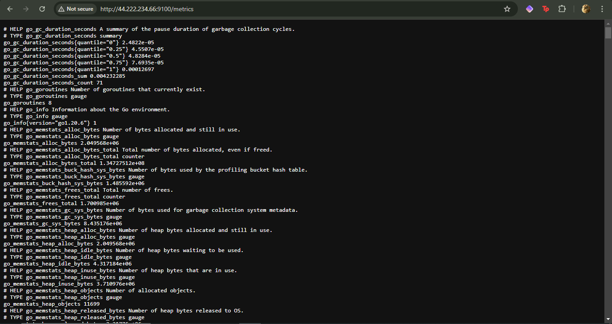
---

## Step 5: Configure Security Groups

### Allow Access to Node Exporter
1. In your EC2 instance's security group, add an inbound rule to allow traffic on port `9100` from your local machine’s IP address (or a more restricted IP range).
2. If your application is running on port `80` or `3000`, ensure to add rules to allow access to those ports as well.

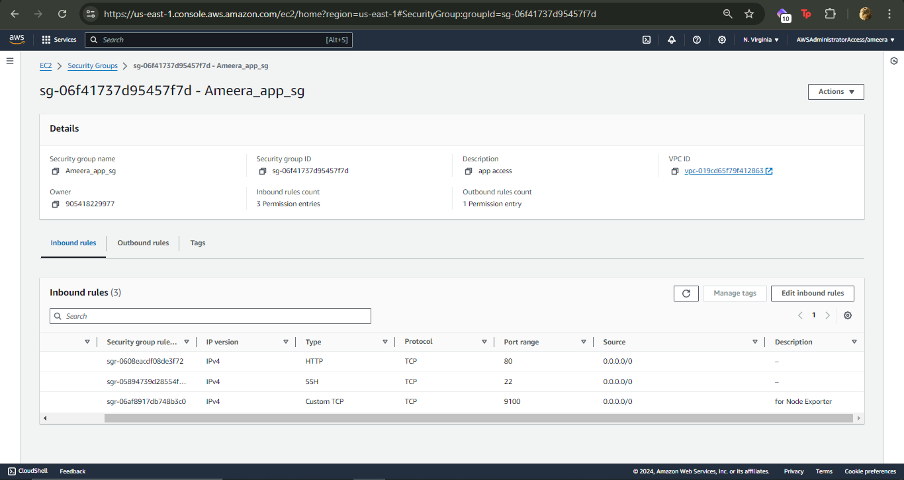

---

## Step 6: Configure Prometheus to Scrape Metrics

### Update `prometheus.yml`
1. On your local Windows machine, update the `prometheus.yml` configuration file located in your Prometheus directory.
2. Add a job to scrape the Node Exporter running on your EC2 instance:
   ```yaml
   scrape_configs:
     - job_name: 'ec2-instance'
       static_configs:
         - targets: ['<your-ec2-instance-public-ip>:9100']
   ```

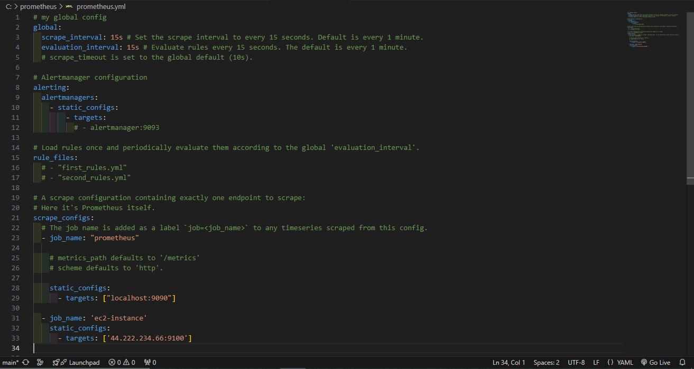

### Restart Prometheus
1. Stop Prometheus by pressing `Ctrl + C` in the Command Prompt or PowerShell where it’s running.
2. Start Prometheus again:
   ```bash
   prometheus.exe --config.file=prometheus.yml
   ```

Prometheus will now scrape metrics from your EC2 instance by collecting data from the Node Exporter.

---

## Step 7: Add Prometheus Data Source in Grafana

### Access Grafana
1. Open your browser and go to `http://localhost:3000`.

### Add Prometheus as a Data Source
1. Go to **Configuration** (gear icon) -> **Data Sources** -> **Add Data Source**.
2. Select **Prometheus**.
3. In the URL field, enter:
   ```plaintext
   http://localhost:9090
   ```
4. Click **Save & Test** to ensure that Grafana can communicate with Prometheus.

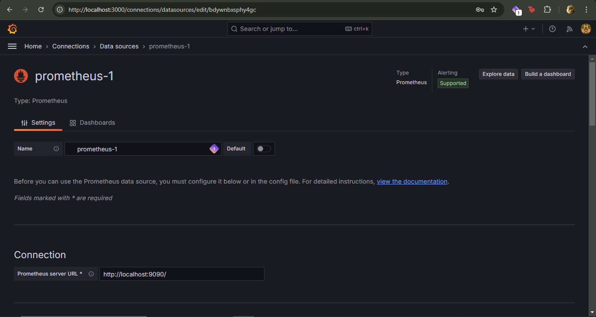

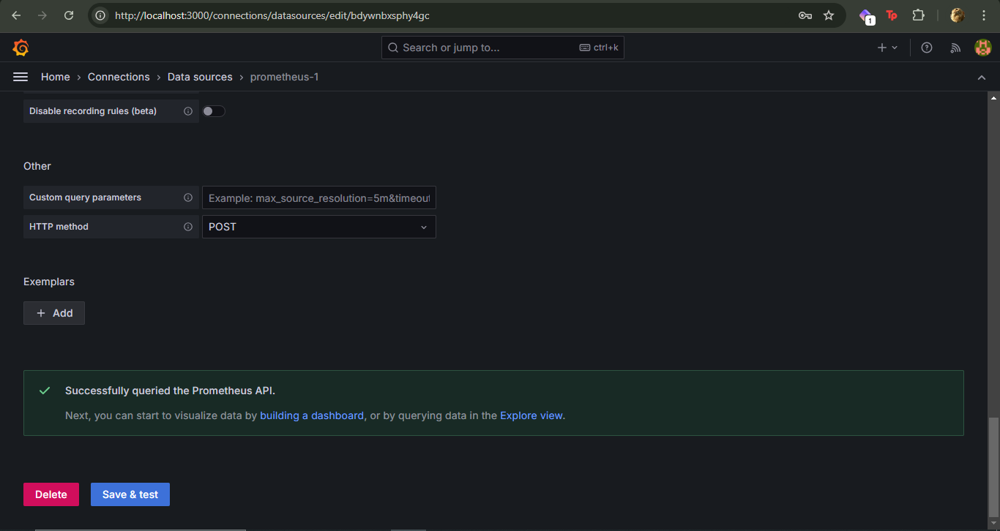
---

## Step 8: Create Panels for Visualizations

### Access Your Grafana Dashboard
1. Open Grafana in your browser (e.g., `http://localhost:3000`).
2. Navigate to your existing dashboard or create a new one.

### Add a New Panel
1. Click on **Add Panel** or the **Add (+)** button and select **Add new panel**.

### Configure the Panel

#### Example 1: CPU Usage Panel
1. **Select the Query**: 
   - Use the metric `rate(node_cpu_seconds_total[5m])` for CPU usage.
   - Adjust the query to focus on specific CPU modes:
     ```bash
     sum by (mode) (rate(node_cpu_seconds_total[5m]))
     ```
2. **Set Visualization Type**: Choose **Graph** (or **Time Series**).
3. **Add a Legend**: Enable the legend to show CPU modes (user, system, idle).
4. **Set Axes**: Configure the Y-axis to display as a percentage and set the unit to Percentage.
5. **Customize Panel**: Add a descriptive title (e.g., "CPU Usage").

#### Example 2: Memory Usage Panel
1. **Create Another Panel**: Follow the same steps to add a new panel for memory usage.
2. **Select the Query**:
   ```bash
   node_memory_MemTotal_bytes - node_memory_MemAvailable_bytes
   ```
   To calculate the percentage:
   ```bash
   100 - (node_memory_MemAvailable_bytes * 100 / node_memory_MemTotal_bytes)
   ```
3. **Set Visualization Type**: Choose **Gauge** or **Graph** for visual representation.
4. **Configure Display Options**: Set thresholds for warning and critical levels (e.g., yellow for 70% usage, red for 90%).
5. **Customize the Panel**: Title it "Memory Usage" and adjust the visual settings to your preference.

#### Example 3: Disk Usage Panel
1. **Add a New Panel**: Create another panel for disk usage.
2. **Select the Query**:
   ```bash
   node_filesystem_size_bytes{fstype="ext4"} - node_filesystem_free_bytes{fstype="ext4"}
   ```
3. **Choose Visualization Type**: Use **Bar Gauge** or **Graph**.
4. **Add a Legend**: Show the percentage of used vs. total disk space.
5. **Customize the Panel**: Title it "Disk Usage" and configure any thresholds.

#### Example 4: Network Traffic Panel
1. **Add Another Panel**: For monitoring network traffic, add a new panel.
2. **Select the Query**:
   ```bash
   rate(node_network_receive_bytes_total[5m])
   ```
3. **Choose Visualization**: Use **Time Series** or **Graph**.
4. **Display Options**: Set the unit to bytes/sec.
5. **Customize the Panel**: Title it "Network Traffic" and adjust axes and legend as needed.

---

## Step 9: Organize Your Dashboard

### Arrange Panels
1. Drag and drop panels to arrange them in a way that makes sense for your monitoring needs.
2. Adjust the dashboard settings to configure the time range for the dashboard (e.g., last 1 hour, last 24 hours).
3. Save the dashboard by clicking the **Save** icon in the top right corner.

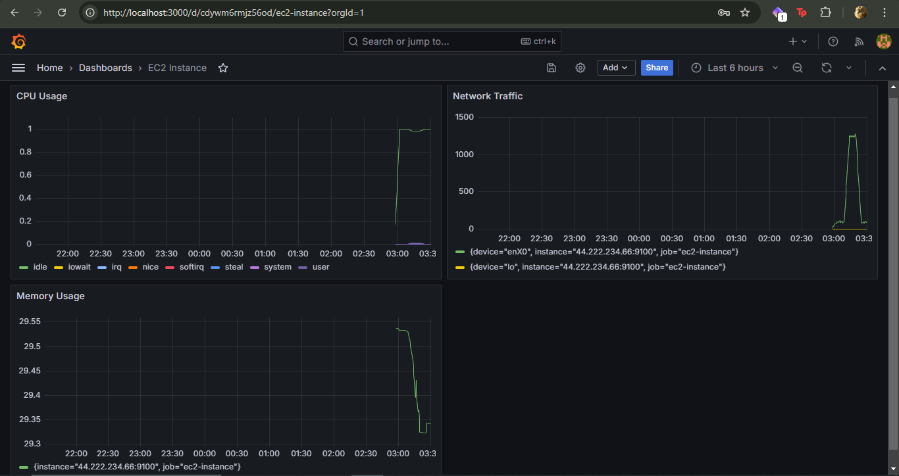

---

## Step 10: (Optional) Set Up Alerts in Grafana

### Create Alerts for Critical Metrics
1. For each panel, go to the **Alert** tab while configuring the panel.
2. Set conditions for alerting (e.g., when CPU usage exceeds a certain threshold).
3. Configure notification channels (e.g., email, Slack) to receive alerts.

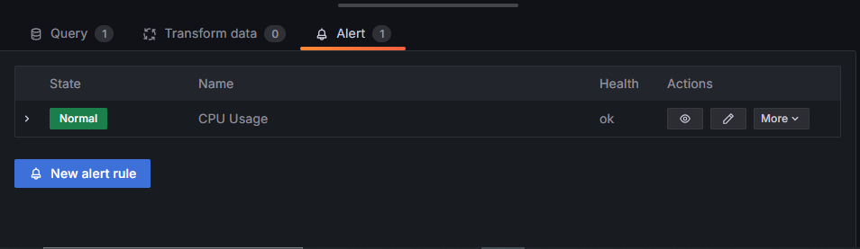

---

By following these steps, you should now have a fully functional monitoring system using Prometheus and Grafana to visualize metrics from your EC2 instance.

--- 