# Cloud Deployment with Ansible: Deploying WordPress with MySQL and Docker

## Objective

In this project, we will deploy a small cloud infrastructure using AWS EC2 instances and manage it using Ansible. The objective is to deploy virtual machines (VMs) in the cloud, configure Ansible for automation, and run playbooks to install Docker and deploy WordPress using a dynamic inventory setup.

### Steps:

---

## Step 1: Deploy EC2 Instances (Virtual Machines)

- **Provision 3 EC2 Instances**:
  - **1 Control Node**: This is where Ansible will be installed to manage the other VMs.
    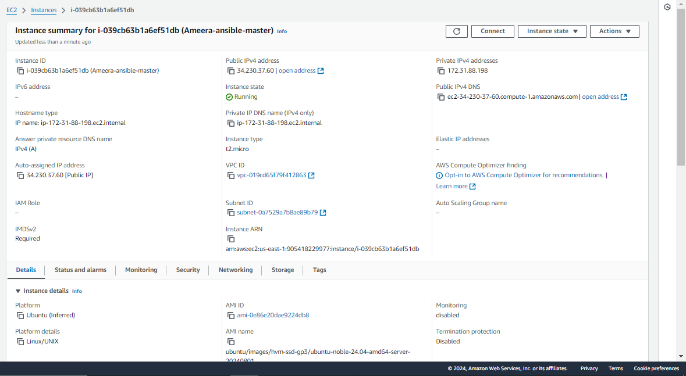

  - **2 Managed Nodes**: These VMs will be used to install Docker and run containers (MySQL and WordPress).
    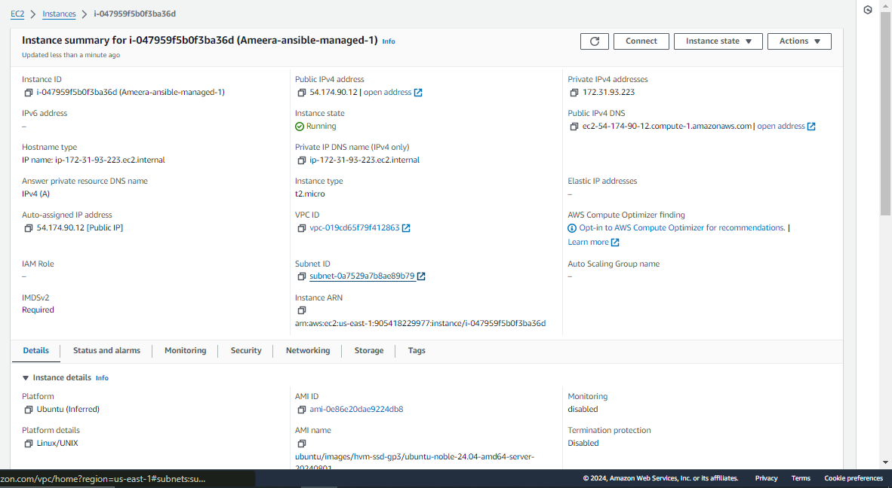
    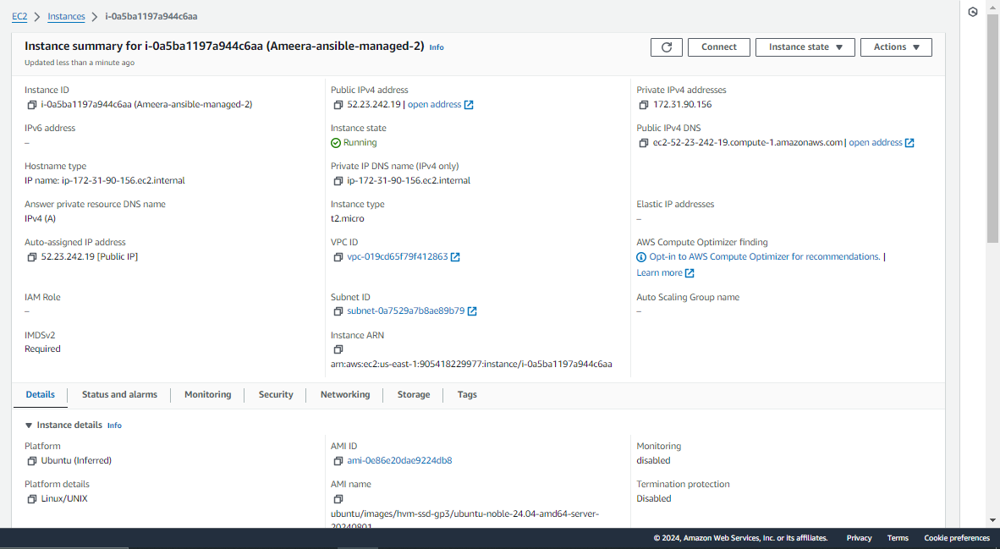
  
  Ensure that the Control Node can SSH into the Managed Nodes using private key authentication.

---

## Step 2: Install Ansible on the Control Plane

- **Ansible Installation**:
  On the control plane (Control Node), install Ansible by running the following commands:

  ```bash
  sudo apt-add-repository ppa:ansible/ansible
  sudo apt update
  sudo apt install ansible
  anisble --version
  ```

  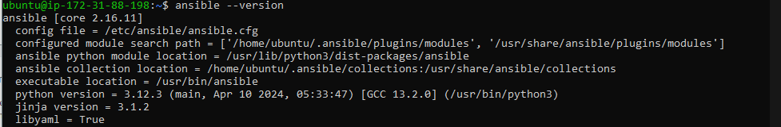

- **Configure SSH Access**:
  Create a new `.pem` file for SSH access, and copy and paste your existing private key into it. Then, add the private key to your SSH agent.

  1. **Create a new `.pem` file**:

     ```bash
     touch ~/my_ssh_key.pem
     chmod 400 ~/my_ssh_key.pem
     ```

  2. **Copy your existing private key** into the new file:

     ```bash
     nano ~/my_ssh_key.pem
     ```

     (Paste your private key content here and save the file.)

  3. **Add the private key to your SSH agent**:

     ```bash
     ssh-add ~/my_ssh_key.pem
     ```

---

## Step 3: Ping Test with Ansible

1. **Create the Inventory File**:
   Use the public IP addresses of the Managed Nodes to create an inventory file:
   
   ```bash
   nano inventory
   ```

   ```ini
   [managed_nodes]
   node1 ansible_host=<node1-public-ip> ansible_user=ubuntu
   node2 ansible_host=<node2-public-ip> ansible_user=ubuntu
   ```

2. **Disable SSH Key Checking**:
   Edit the Ansible configuration file to disable SSH key checking:

   ```bash
   sudo nano /etc/ansible/ansible.cfg
   ```

   Add this configuration:

   ```ini
   [defaults]
   host_key_checking = False
   ```

   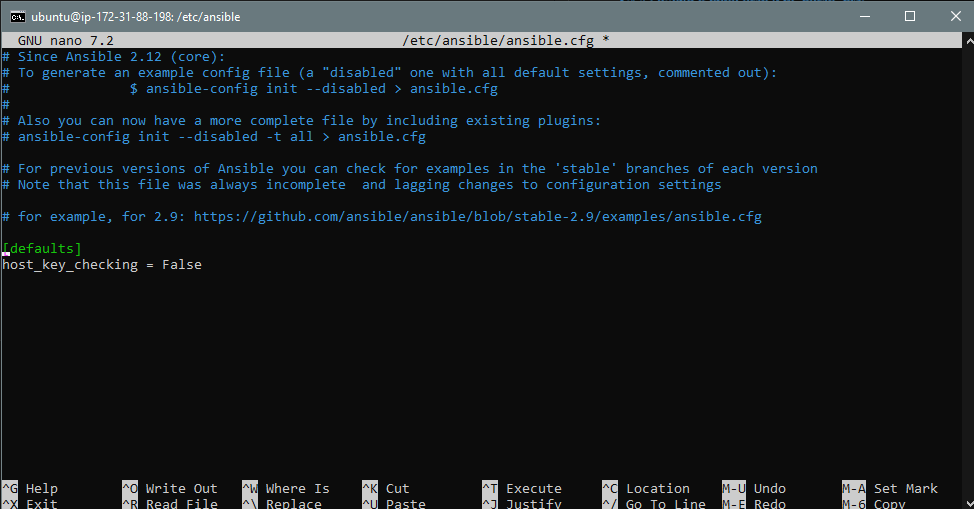

3. **Run a Ping Test**:
   Verify connectivity between the control plane and the managed nodes by running the Ansible ping command:

   ```bash
   ansible -i inventory -m ping all
   ```

   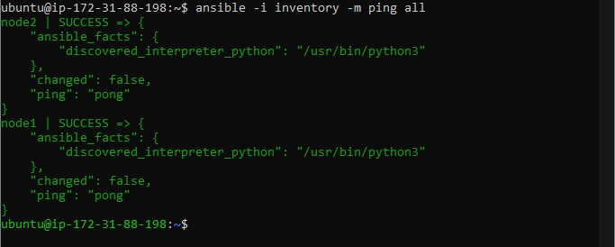

---

## Step 4: Create and Run Ansible Playbook for Docker Installation

- **Playbook for Installing Docker**:
  The first playbook, `docker.yml`, installs Docker on the two managed VMs. This ensures both nodes are Docker-enabled for container deployments.

  ### `docker.yml` Playbook:
    This playbook is designed to install Docker on the managed nodes (i.e., your two EC2 instances). Let’s break down each section of the playbook:

    ```yaml
    ---
    - name: Install Docker on managed nodes
    hosts: managed_nodes
    become: yes
    tasks:
    ```
    - **`name:`** This gives a brief description of what the playbook does, which is to install Docker on the managed nodes.
    - **`hosts:`** This specifies the group of hosts on which the playbook will run. Here, it targets `managed_nodes`, which are defined in the inventory file.
    - **`become: yes`** This instructs Ansible to use `sudo` to run the tasks as a superuser, which is necessary for installing packages.

    ### Tasks

    1. **Update package index:**
    ```yaml
    - name: Update package index
        apt:
        update_cache: yes
    ```
    - This task updates the package index on the managed nodes to ensure that the package manager is aware of the latest versions of the packages.

    2. **Install required packages:**
    ```yaml
    - name: Install required packages
        apt:
        name:
            - apt-transport-https
            - ca-certificates
            - curl
            - software-properties-common
        state: present
    ```
    - This task installs several prerequisites for Docker:
        - **`apt-transport-https`**: Allows the package manager to use `https` repositories.
        - **`ca-certificates`**: Ensures that the system can verify SSL connections.
        - **`curl`**: A tool for transferring data from or to a server.
        - **`software-properties-common`**: Provides an abstraction of the software repository management.

    3. **Add Docker's official GPG key:**
    ```yaml
    - name: Add Docker's official GPG key
        apt_key:
        url: https://download.docker.com/linux/ubuntu/gpg
        state: present
    ```
    - This task adds Docker’s GPG key to the trusted keys of the system. This is important for verifying the authenticity of the Docker packages.

    4. **Set up the stable repository:**
    ```yaml
    - name: Set up the stable repository
        apt_repository:
        repo: "deb [arch=amd64] https://download.docker.com/linux/ubuntu {{ ansible_lsb.codename }} stable"
        state: present
    ```
    - This task adds the Docker repository to the system's package manager. The repository URL uses the LSB codename of the Ubuntu distribution to point to the correct repository.

    5. **Install Docker:**
    ```yaml
    - name: Install Docker
        apt:
        name: docker-ce
        state: latest
    ```
    - This task installs the latest version of Docker Community Edition (`docker-ce`) on the managed nodes.

    6. **Ensure Docker is running:**
    ```yaml
    - name: Ensure Docker is running
        service:
        name: docker
        state: started
        enabled: yes
    ```
    - This task ensures that the Docker service is started and enabled to start on boot. It verifies that Docker is running properly after installation.


- **Run the Playbook**:
  
  ```bash
  ansible-playbook -i inventory docker.yml
  ```

    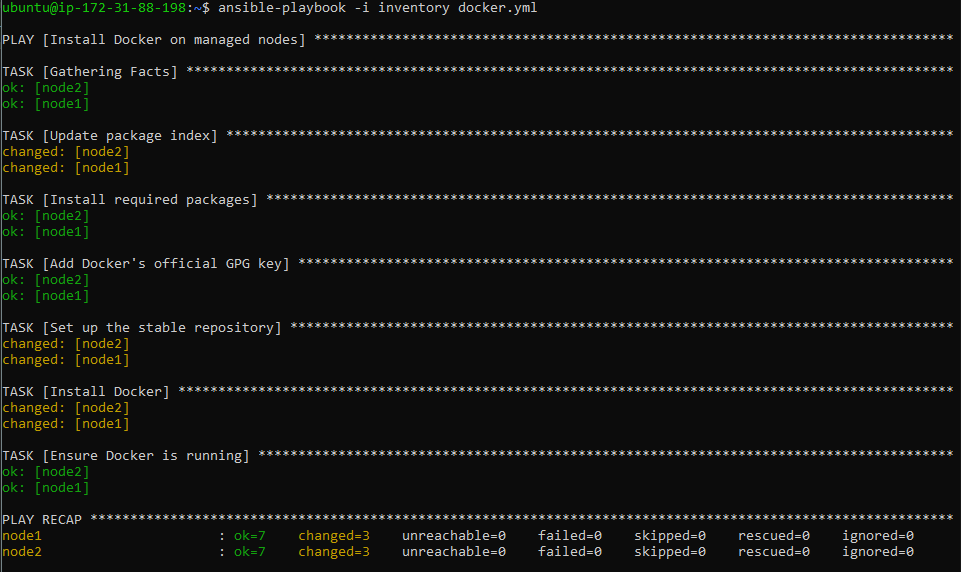

---

## Step 5: Deploy WordPress and MySQL Containers with Ansible

- **Playbook for WordPress and MySQL Deployment**:
  This playbook (`wordpress.yml`) deploys both a MySQL container and a WordPress container. It prompts for secure inputs such as database credentials.

  ### `wordpress.yml` Playbook:

    This playbook handles the deployment of both WordPress and MySQL containers on the managed nodes. It prompts for database credentials to ensure secure storage.

    ```yaml
    ---
    - name: Deploy WordPress and MySQL containers
    hosts: managed_nodes
    become: true
    vars_prompt:
        - name: db_password
        prompt: "Enter MySQL root password"
        private: yes
        - name: wp_db_user
        prompt: "Enter WordPress database username"
        private: no
        - name: wp_db_password
        prompt: "Enter WordPress database password"
        private: yes
    ```
    - **`name:`** Describes the purpose of this playbook.
    - **`hosts:`** Targets the same `managed_nodes` group as before.
    - **`become: true`** Allows for elevated privileges to perform tasks that require administrative rights.
    - **`vars_prompt:`** Prompts the user for sensitive information. Here, it collects:
    - `db_password`: MySQL root password (hidden input).
    - `wp_db_user`: WordPress database username (shown).
    - `wp_db_password`: WordPress database password (hidden input).

    ### Tasks

    1. **Create a Docker network:**
    ```yaml
    - name: Create a Docker network
        docker_network:
        name: wordpress-net
        state: present
    ```
    - This task creates a dedicated Docker network (`wordpress-net`) for the containers. This enables communication between WordPress and MySQL containers.

    2. **Deploy MySQL container:**
    ```yaml
    - name: Deploy MySQL container
        docker_container:
        name: mysql
        image: mysql:latest
        env:
            MYSQL_ROOT_PASSWORD: "{{ db_password }}"
            MYSQL_DATABASE: wordpress
            MYSQL_USER: "{{ wp_db_user }}"
            MYSQL_PASSWORD: "{{ wp_db_password }}"
        networks:
            - name: wordpress-net
        state: started
        recreate: true
    ```
    - This task deploys the MySQL container:
        - **`name:`** Sets the container name to `mysql`.
        - **`image:`** Specifies the MySQL image to use.
        - **`env:`** Sets environment variables for MySQL, including:
        - `MYSQL_ROOT_PASSWORD`: Uses the variable provided by the user.
        - `MYSQL_DATABASE`: Creates a database named `wordpress`.
        - `MYSQL_USER` and `MYSQL_PASSWORD`: Creates a user with the specified username and password.
        - **`networks:`** Connects the MySQL container to the `wordpress-net` Docker network.
        - **`state: started`** ensures the container is running.
        - **`recreate: true`** ensures the container is recreated if it already exists.

    3. **Deploy WordPress container:**
    ```yaml
    - name: Deploy WordPress container
        docker_container:
        name: wordpress
        image: wordpress
        env:
            WORDPRESS_DB_NAME: wordpress
            WORDPRESS_DB_HOST: "mysql"
            WORDPRESS_DB_USER: "{{ wp_db_user }}"
            WORDPRESS_DB_PASSWORD: "{{ wp_db_password }}"
        networks:
            - name: wordpress-net
        ports:
            - "80:80"
        state: started
        recreate: true
    ```
    - This task deploys the WordPress container:
        - **`name:`** Sets the container name to `wordpress`.
        - **`image:`** Uses the official WordPress image.
        - **`env:`** Sets environment variables for WordPress, including:
        - `WORDPRESS_DB_NAME`: Points to the database created earlier.
        - `WORDPRESS_DB_HOST`: Connects to the MySQL container.
        - `WORDPRESS_DB_USER` and `WORDPRESS_DB_PASSWORD`: Uses the user credentials provided by the user.
        - **`networks:`** Connects to the same `wordpress-net` Docker network.
        - **`ports:`** Maps port 80 of the container to port 80 on the host, allowing access to the WordPress application.
        - **`state: started`** ensures the container is running.
        - **`recreate: true`** ensures the container is recreated if it already exists.
  
- **Run the Playbook**:

  ```bash
  ansible-playbook -i inventory wordpress.yml
  ```

  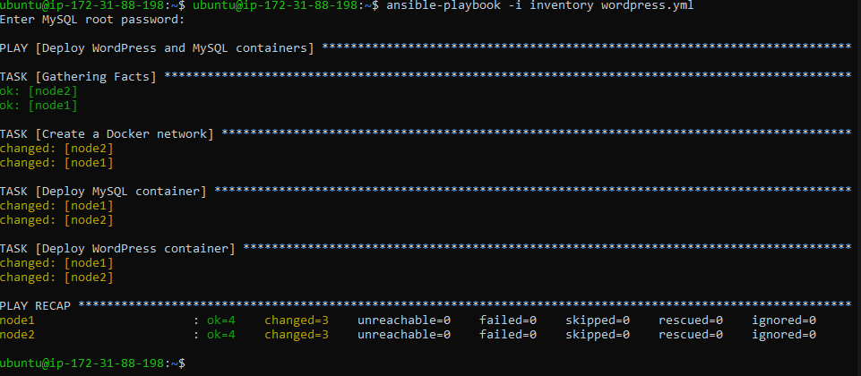

- **Verify Successful Deployment**:
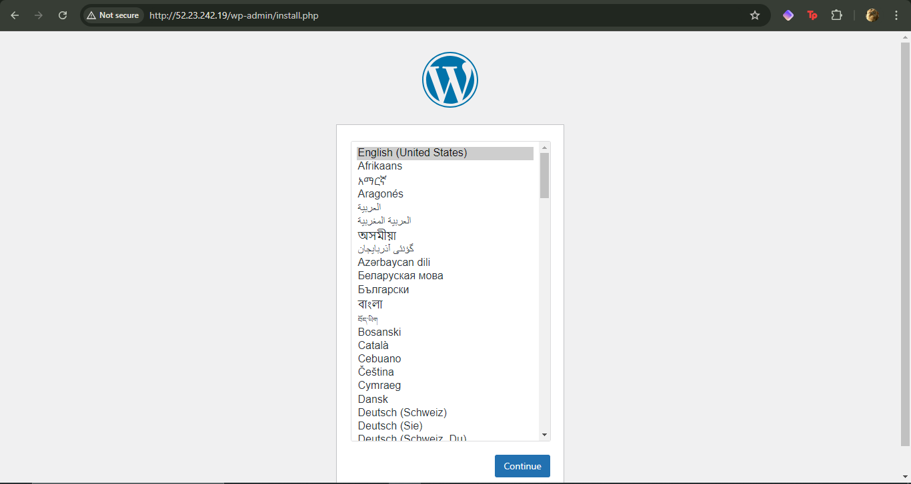
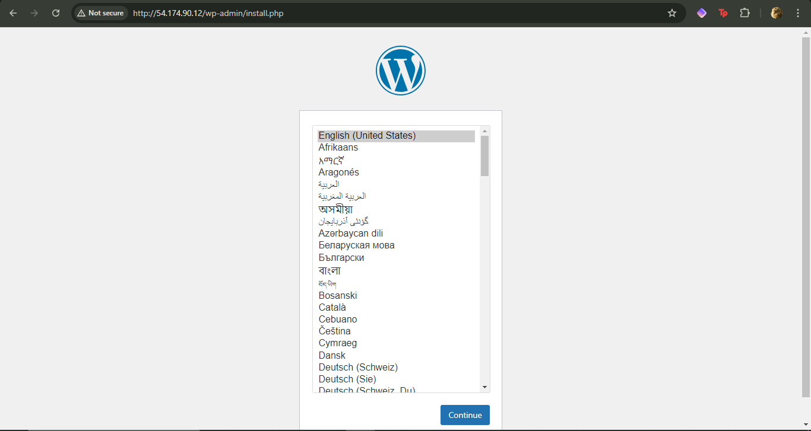
---

## Step 6: Dynamic Inventory Setup

To avoid managing static IP addresses, you can configure a dynamic inventory using AWS EC2's plugin.

- **Install Boto3**:
  Install Boto3 for dynamic inventory:

  ```bash
  sudo apt install -y python3-boto3
  ```

- **AWS CLI**:
  Install and configure the AWS CLI to use credentials for managing instances.

  ```bash
  aws configure
  ```

- **Dynamic Inventory Configuration**:
  Create a `aws_ec2.yaml` file to set up dynamic inventory:

  ### `aws_ec2.yaml`:

  ### **Plugin Declaration**
    ```yaml
    plugin: amazon.aws.aws_ec2
    ```
    - **`plugin:`** This line specifies the use of the `aws_ec2` dynamic inventory plugin from the `amazon.aws` collection. This plugin allows Ansible to dynamically pull EC2 instance data from AWS.

    ### **Profile Specification**
    ```yaml
    profile: AWSAdministratorAccess-905418229977
    ```
    - **`profile:`** This line specifies the AWS credentials profile to use for authentication. The profile must be configured in the AWS credentials file (usually located at `~/.aws/credentials`), allowing Ansible to access AWS resources using the permissions associated with that profile.

    ### **Regions Specification**
    ```yaml
    regions:
    - us-east-1
    ```
    - **`regions:`** This section specifies which AWS region(s) to query for EC2 instances. In this example, it is set to `us-east-1`, but you can modify it to target different regions as needed (e.g., `us-west-1`, `eu-central-1`, etc.).

    ### **Filters**
    ```yaml
    filters:
    instance-state-name: running
    "tag:Type":
        - Managed
    ```
    - **`filters:`** This section allows you to specify conditions to filter the instances that will be included in the inventory.
    - **`instance-state-name: running`**: This filter ensures that only EC2 instances in the "running" state are included in the inventory.
    - **`"tag:Type": - Managed`**: This filter checks for instances that have a tag with the key `Type` and a value of `Managed`. This means only instances tagged as "Managed" will be considered in the inventory, allowing for targeted automation on specific instances.

    ### **Keyed Groups**
    ```yaml
    keyed_groups:
    - key: tags
        prefix: tag
    ```
    - **`keyed_groups:`** This section enables grouping of hosts based on specific attributes.
    - **`key:`** This specifies that the grouping should be based on the tags assigned to the EC2 instances.
    - **`prefix:`** This adds a prefix to the group names created from the tags. For instance, if an instance has a tag `environment: production`, it will create a group called `tag_environment_production`.

  **Test Dynamic Inventory**:
  
  Run the following commands to test the dynamic inventory setup:

  ```bash
  ansible-inventory -i aws_ec2.yaml --list
  ansible-inventory -i aws_ec2.yaml --graph
  ```

  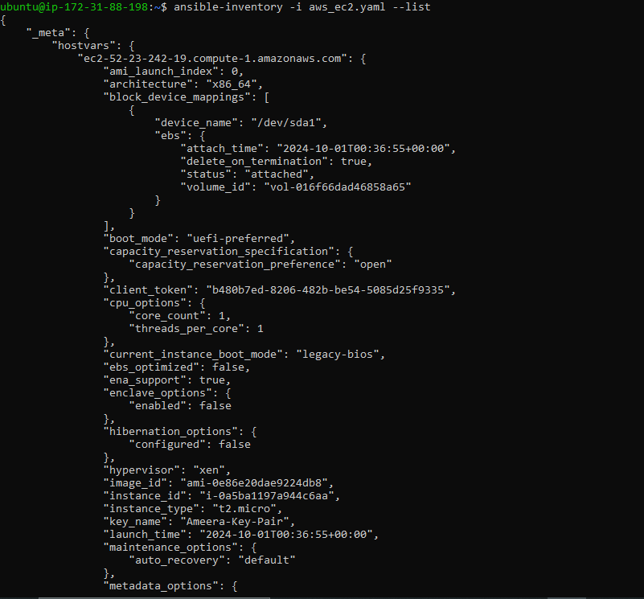
  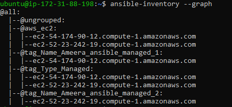
  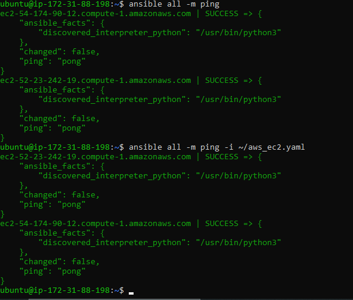

---

## Step 7: Modify Playbooks for Dynamic Inventory

Once your dynamic inventory is set up, modify your existing playbooks to use this inventory file instead of the static inventory you created earlier.

### Update Commands to Use Dynamic Inventory

When running your Ansible playbooks, specify the dynamic inventory file like this:

```bash
ansible-playbook -i aws_ec2.yaml docker.yml
```

```bash
ansible-playbook -i aws_ec2.yaml wordpress.yml
```

This way, Ansible will dynamically pull the list of your EC2 instances, ensuring that your playbooks always target the correct hosts, even if the IP addresses or instance states change.

---
## Conclusion

This guide demonstrated how to use Ansible to deploy a WordPress application on AWS EC2 instances. By following these steps, you not only learned how to provision and manage cloud resources but also how to use Ansible playbooks to automate the installation of Docker and the deployment of containers.