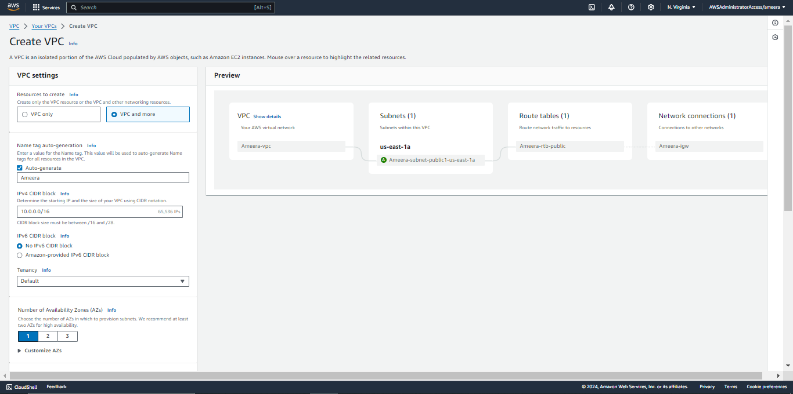
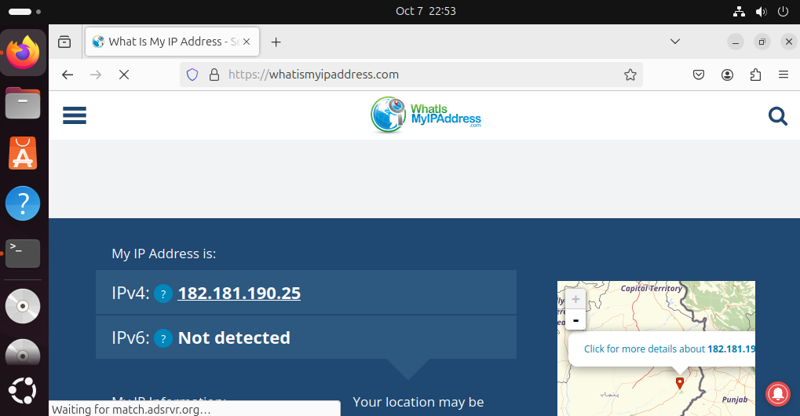
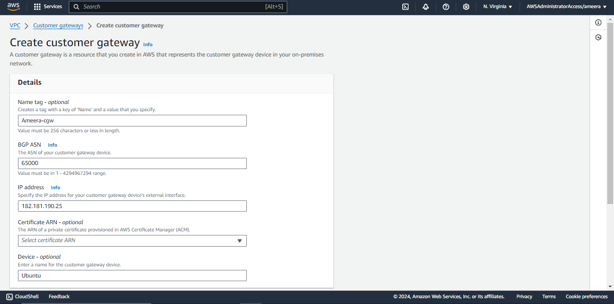

# Site-to-Site VPN Setup Between AWS VPC and Ubuntu Machine

This guide explains how to set up a site-to-site VPN between an AWS VPC and an Ubuntu 20.04 machine using StrongSwan. The steps include creating a VPC on AWS, configuring the VPN connection, and setting up StrongSwan on Ubuntu.

## Prerequisites

- AWS account
- Ubuntu 20.04 machine (on-premise or VM)

---

## Step 1: Create VPC with a Public Subnet

1. **Go to AWS VPC Wizard**  
   In the AWS Management Console, navigate to **VPC** > **Your VPCs** > **Launch VPC Wizard**.
2. **Select “VPC with a Single Public Subnet”**  
   Choose the VPC with a Single Public Subnet option. This will automatically create a VPC, an internet gateway, a public subnet, and a route table.

   **VPC Name**: `MyVPC`  
   **CIDR Block**: `10.0.0.0/16`  
   **Subnet Name**: `PublicSubnet`  
   **Subnet CIDR Block**: `10.0.1.0/24`

3. **Launch the VPC**  
   Click **Create VPC**.



---

## Step 2: Create a Customer Gateway (CGW)

A Customer Gateway (CGW) represents the external device (your Ubuntu server) that connects to the AWS VPN.

1. **Go to AWS Console** > **VPN** > **Customer Gateways** > **Create Customer Gateway**.
2. **Configure Customer Gateway**:

   - **Name**: `UbuntuCGW`
   - **Routing**: Static
   - **IP Address**: Use the public IP of your Ubuntu machine. To get this, go to `whatsmyipaddress.com`.

     

   - **BGP ASN**: Leave as default.

3. Click **Create Customer Gateway**.


---

## Step 3: Create a Virtual Private Gateway (VGW)
A Virtual Private Gateway (VGW) is a VPN concentrator on the AWS side of the connection.

1. **Go to AWS Console** > **VPN** > **Virtual Private Gateways** > **Create Virtual Private Gateway**.
2. **Name**: `MyVGW`  
   **ASN**: Leave default.
3. Click **Create Virtual Private Gateway**.

4. **Attach the VGW to the VPC**:
   - Go to **Actions** > **Attach to VPC** > Select `MyVPC`.

---

## Step 4: Create a VPN Connection

The VPN connection represents the encrypted tunnel between the AWS VPC and your Ubuntu server.


1. **Go to AWS Console** > **VPN** > **Create VPN Connection**.
2. **Configuration**:

   - **Target Gateway**: Select the Virtual Private Gateway (VGW) created earlier.
   - **Customer Gateway**: Select the Customer Gateway (CGW) you created.
   - **Routing**: Static.
   - **Static IP Prefixes**: Enter the private IP range of your Ubuntu machine (for example, `192.168.1.0/24`).

3. Click **Create VPN Connection**.

4. **Download VPN Configuration**:  
   Once the VPN connection is created, download the VPN configuration for StrongSwan from AWS. You will use this file to configure your Ubuntu machine.

---

## Step 5: Update Route Tables
Route propagation allows the VGW to propagate routes back to your on-premise Ubuntu machine.

1. **Go to AWS Console** > **VPC** > **Route Tables**.
2. **Select the Route Table** associated with your VPC.

3. **Edit Route Propagation**:

   - Go to **Route Propagation** > **Edit**.
   - Enable the propagation for the Virtual Private Gateway (VGW).

4. Save the changes.

---

## Step 6: Install and Configure StrongSwan on Ubuntu

StrongSwan is the VPN software used to establish the IPsec connection on your Ubuntu machine. The configuration file from AWS contains all the necessary parameters to set up the connection.

### Install StrongSwan

SSH into your Ubuntu 20.04 machine and install StrongSwan using the following command:

```bash
sudo apt update
sudo apt install strongswan strongswan-pki libcharon-extra-plugins libcharon-extauth-plugins libstrongswan-extra-plugins libtss2-tcti-tabrmd0 -y
```

### Generate Server Keys and Certificates

#### Step 1: Generate IPsec Private Key

```bash
sudo ipsec pki --gen --size 4096 --type rsa --outform pem > /etc/ipsec.d/private/ca.key.pem
```

#### Step 2: Create and Sign the Root Certificate

```bash
sudo ipsec pki --self --in /etc/ipsec.d/private/ca.key.pem --type rsa --dn "CN=YourVPNServerName" --ca --lifetime 3650 --outform pem > /etc/ipsec.d/cacerts/ca.cert.pem
```

#### Step 3: Generate VPN Server Private Certificate

```bash
sudo ipsec pki --gen --size 4096 --type rsa --outform pem > /etc/ipsec.d/private/server.key.pem
```

#### Step 4: Generate Host Server Certificate (Using Static IP)

```bash
sudo ipsec pki --pub --in /etc/ipsec.d/private/server.key.pem --type rsa | sudo ipsec pki --issue --lifetime 3650 --cacert /etc/ipsec.d/cacerts/ca.cert.pem --cakey /etc/ipsec.d/private/ca.key.pem --dn "CN=YourServerPublicIP" --san="YourServerPublicIP" --san="YourServerPublicIP" --flag serverAuth --flag ikeIntermediate --outform pem > /etc/ipsec.d/certs/server.cert.pem
```

### Configure StrongSwan Using AWS Configuration

1. **Upload the Configuration File**:  
   Use `scp` to transfer the AWS VPN configuration file to your Ubuntu machine.

2. **Edit `/etc/ipsec.conf`**:  
   Replace the contents of your `/etc/ipsec.conf` file with the values from the downloaded AWS VPN configuration.

3. **Edit `/etc/ipsec.secrets`**:  
   Similarly, update your `/etc/ipsec.secrets` file with the credentials and secrets provided in the AWS VPN configuration.

4. **Restart StrongSwan**:

```bash
sudo systemctl restart strongswan
```
---

## Step 7: Verify the VPN Connection

This verifies that the VPN tunnel between the AWS VPC and the Ubuntu machine is active and operational.

1. **On Ubuntu**:

   - Check the status of the VPN connection:
     ```bash
     sudo ipsec status
     ```
   - Ensure that the connection is established and active.

2. **On AWS**:
   - Go to **VPN Connections** in the AWS console.
   - Check the **Tunnel Status** and ensure that at least one tunnel is up.

---

## Step 8: Test Connectivity
This ensures that the site-to-site VPN is working correctly and that both networks can communicate securely.

1. **Ping Ubuntu Machine**:  
   From an instance inside your AWS VPC, try to ping the private IP of your Ubuntu machine.

2. **Ping AWS Instance**:  
   From your Ubuntu machine, try to ping the private IP of an instance in your AWS VPC.

---

## Conclusion

You have successfully set up a site-to-site VPN between your AWS VPC and an Ubuntu machine using StrongSwan. Now both networks can securely communicate over an encrypted tunnel.

---
