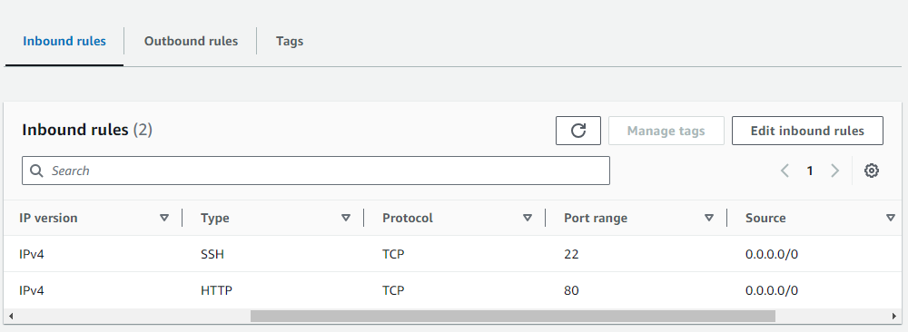

# NGINX Load Balancer Setup on AWS EC2

## Objective
Set up an NGINX load balancer on an EC2 instance to distribute traffic to two backend EC2 instances.

## Outputs
- A fully functional NGINX load balancer running on an EC2 instance.
- Two backend EC2 instances with simple web servers.
- Detailed documentation of the setup process.

## Prerequisites
- Basic understanding of NGINX.
- AWS account with appropriate permissions.
- Bitvise SSH Client installed for managing SSH connections to EC2 instances.

## How to Run This Code
Follow the steps below to set up your NGINX load balancer and backend servers.

### 1. Create Key Pair and Security Group

1. **Create Key Pair**
   - Go to the AWS Management Console.
   - Navigate to EC2 Dashboard > Key Pairs.
   - Create a new key pair and download it.
    

1. **Create Security Group**
   - Go to the AWS Management Console.
   - Navigate to EC2 Dashboard > Security Groups.
   - Create a new security group with the following rules:
     - Allow SSH access (port 22) from your IP address.
     - Allow HTTP access (port 80) from anywhere (0.0.0.0/0) for testing purposes.
    
    

### 2. Launch Backend EC2 Instances

1. Open the AWS Management Console and navigate to the EC2 Dashboard.
2. Click on "Launch Instance" and choose Amazon Linux 2 AMI.
3. Choose Instance Type `t2.micro`.
4. Configure Instance Details:
   - Number of instances: 2
   - Network: default VPC
   - Subnet: Select a suitable subnet.
   - Auto-assign Public IP: Enable (so you can SSH into the instances).
   - Configure Security Group to use the one created earlier.
   - Assign Tags: Tag your instances for easy identification (e.g., Key: Name, Value: Backend-1 and Backend-2).
5. Choose an existing key pair.
6. Review and Launch.
   

### 3. Configure Backend EC2 Instances

1. **Connect to Instances using Bitvise**
   - Use SSH to connect to your Instances.

2. **Update the Package List and Install NGINX**
   ```sh
        sudo yum update -y
        sudo amazon-linux-extras install nginx1 -y
        sudo systemctl start nginx
        sudo systemctl enable nginx
    ```

3. **Create a Simple Web Page**
   ```sh
   echo "Backend Server 2" | sudo tee /usr/share/nginx/html/index.html
   ```

- Repeat for Server 2 with the appropriate message.

### 4. Launch NGINX Load Balancer EC2 Instance
1. Open the AWS Management Console and navigate to the EC2 Dashboard.
2. Click on "Launch Instance" and choose Amazon Linux 2 AMI.
3. Choose Instance Type t2.micro.
4. Configure Instance Details:
   - Number of instances: 1
   - Network: default VPC
   - Subnet: Select a suitable subnet.
   - Auto-assign Public IP: Enable (so you can SSH into the instances).
   - Configure Security Group to use the one created earlier.
   - Assign Tags: Tag your instance for easy identification (e.g., Key: Name, Value: LoadBalancer).
5. Choose an existing key pair.
6. Review and Launch.
   

### 5. Configure NGINX for Load Balancing

1. Connect to Instances using Bitvise
   - Use SSH to connect to your Instances.
  
2. **Update the Package List and Install NGINX**
   ```sh
        sudo yum update -y
        sudo amazon-linux-extras install nginx1 -y
        sudo systemctl start nginx
        sudo systemctl enable nginx
    ```

3. Open the NGINX Configuration File
   ```sh
   sudo nano /etc/nginx/nginx.conf
   ```

4. Add the Following Configuration inside the http Block
    ```sh
    events {}
    http {
        upstream backend_servers {
            server 34.204.3.96;
            server 44.212.72.185;
        }

        server {
            listen 80;

            location / {
                proxy_pass http://backend_servers;
            }
        }
    }
    ```

2. Test NGINX Configuration and Enable 
   ```sh
        sudo nginx -t
        sudo systemctl start nginx
        sudo systemctl enable nginx
    ```

### 6. Test Load Balancer
1. Verify Traffic Distribution
    - Open a web browser and enter the public IP address of your load balancer instance.
    - Refresh the page multiple times and observe the responses. You should see alternating responses from "Backend Server 1" and "Backend Server 2", indicating that the load balancer is distributing traffic between the two backend servers.
    
    