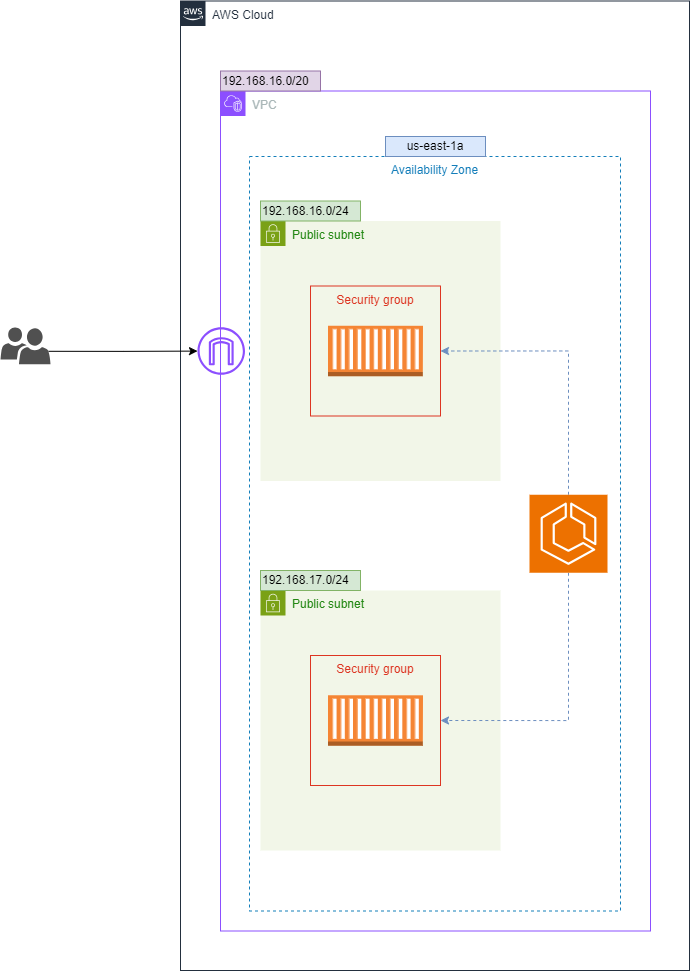

# ECS Fargate Nginx Server Deployment with Terraform

## Table of Contents
- [ECS Fargate Nginx Server Deployment with Terraform](#ecs-fargate-nginx-server-deployment-with-terraform)
  - [Table of Contents](#table-of-contents)
  - [Introduction](#introduction)
  - [Prerequisites](#prerequisites)
  - [Architecture Overview](#architecture-overview)
  - [Modules](#modules)
    - [VPC](#vpc)
    - [Security Group](#security-group)
    - [ECS Cluster](#ecs-cluster)
    - [ECS Service](#ecs-service)
  - [Setup Instructions](#setup-instructions)
    - [Clone the Repository](#clone-the-repository)
    - [Configure AWS CLI](#configure-aws-cli)
    - [Initialize Terraform](#initialize-terraform)
    - [Apply Terraform Configuration](#apply-terraform-configuration)
    - [Outputs](#outputs)
    - [Cleanup](#cleanup)

## Introduction

This project sets up an Nginx server running on Amazon ECS Fargate using Terraform. It involves creating a VPC, security group, ECS cluster, and ECS service with minimal configurations. The purpose is to demonstrate how to use Terraform to automate the infrastructure setup for containerized applications.

## Prerequisites

Before you begin, ensure you have the following installed:

- [Terraform](https://www.terraform.io/downloads.html)
- [AWS CLI](https://aws.amazon.com/cli/)
- An AWS account with appropriate permissions

## Architecture Overview

The project consists of the following components:

1. **VPC**: A Virtual Private Cloud to host our infrastructure.
2. **Security Group**: Security group to allow traffic to our ECS tasks.
3. **ECS Cluster**: An ECS cluster to manage our ECS services.
4. **ECS Service**: An ECS service running an Nginx container using Fargate.



## Modules

### VPC

The VPC module creates a VPC, subnets, an internet gateway, and route tables.

### Security Group

The Security Group module creates a security group allowing inbound traffic on ports 22 and 80.

### ECS Cluster

The ECS Cluster module creates an ECS cluster.

### ECS Service
The ECS Service module creates an ECS task definition and service to run an Nginx container.

## Setup Instructions

### Clone the Repository

Clone this repository to your local machine.

```sh
git clone https://github.com/your-repo/ecs-fargate-nginx.git
cd ecs-fargate-nginx
```

### Configure AWS CLI

Ensure your AWS CLI is configured with the correct profile.

```sh
aws configure
```

### Initialize Terraform

Initialize Terraform in your project directory.

```sh
terraform init
```

### Apply Terraform Configuration

Apply the Terraform configuration to set up your infrastructure.

```sh
terraform apply
```

Type 'yes' when prompted to confirm the changes.

### Outputs

After applying the Terraform configuration, the following outputs will be displayed:

- ecs_cluster_name: The name of the ECS cluster.

### Cleanup

To destroy the resources created by Terraform, run:

```sh
terraform destroy
```

Type 'yes' when prompted to confirm the destruction.

