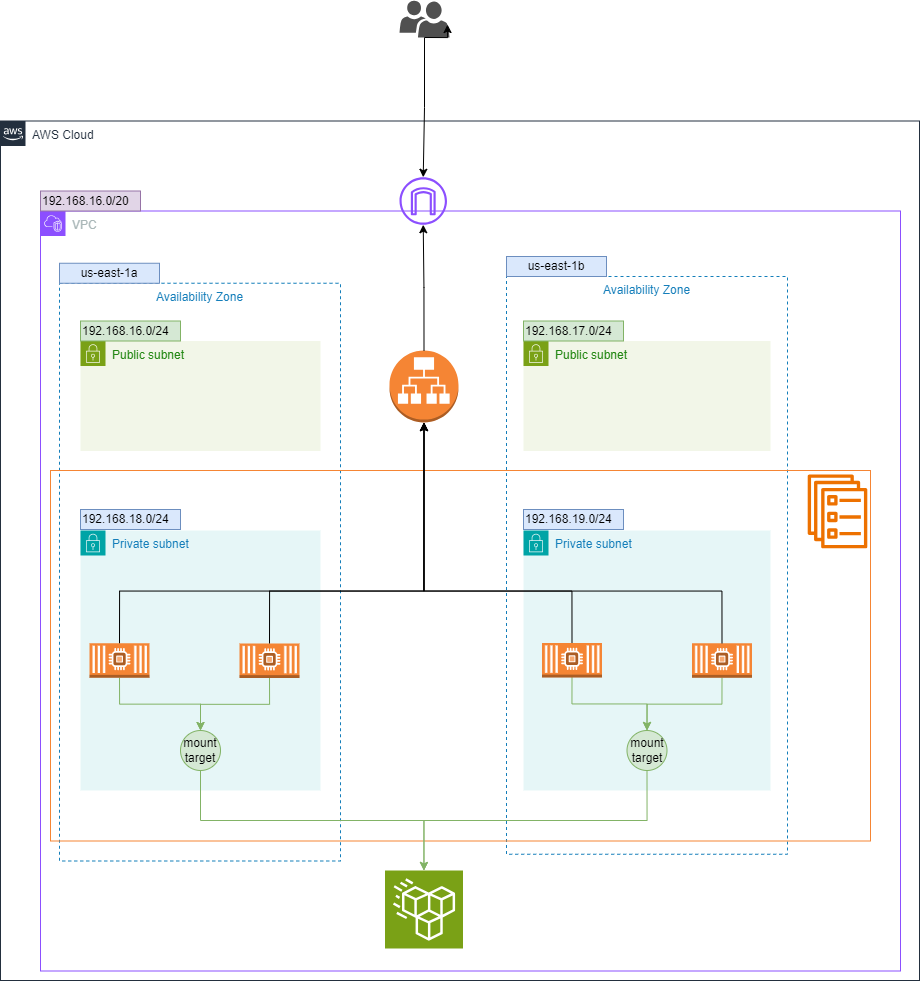

# ECS Fargate Nginx Server Deployment with ALB and EFS using Terraform

## Table of Contents
- [ECS Fargate Nginx Server Deployment with ALB and EFS using Terraform](#ecs-fargate-nginx-server-deployment-with-alb-and-efs-using-terraform)
  - [Table of Contents](#table-of-contents)
  - [Introduction](#introduction)
  - [Prerequisites](#prerequisites)
  - [Architecture Overview](#architecture-overview)
  - [Modules](#modules)
    - [VPC](#vpc)
    - [Security Groups](#security-groups)
    - [ECS Cluster](#ecs-cluster)
    - [ECS Task Definition](#ecs-task-definition)
    - [ECS Service](#ecs-service)
    - [Elastic File System (EFS)](#elastic-file-system-efs)
    - [Application Load Balancer (ALB)](#application-load-balancer-alb)
  - [Setup Instructions](#setup-instructions)
    - [Clone the Repository](#clone-the-repository)
    - [Configure AWS CLI](#configure-aws-cli)
    - [Initialize Terraform](#initialize-terraform)
    - [Apply Terraform Configuration](#apply-terraform-configuration)
    - [Outputs](#outputs)
    - [Cleanup](#cleanup)
  
## Introduction

This project sets up a highly available and scalable Nginx server infrastructure on Amazon ECS Fargate using Terraform. The setup includes a VPC, security groups, ECS cluster, ECS service with a custom Docker image, an Application Load Balancer (ALB), and an Elastic File System (EFS) for persistent storage.

## Prerequisites

Before you begin, ensure you have the following:

- [Terraform](https://www.terraform.io/downloads.html) installed
- [AWS CLI](https://aws.amazon.com/cli/) installed and configured
- An AWS account with necessary permissions to create resources

## Architecture Overview

The architecture includes the following components:

1. **VPC**: A Virtual Private Cloud for networking.
2. **Security Groups**: Define access rules for the ECS tasks, ALB, and EFS.
3. **ECS Cluster**: Manages the deployment of the ECS services.
4. **ECS Task Definition**: Defines the Docker container settings, including the use of a custom Docker image with Amazon EFS support.
5. **ECS Service**: Deploys the Docker container across multiple availability zones for high availability.
6. **Elastic File System (EFS)**: Provides shared file storage for the ECS tasks.
7. **Application Load Balancer (ALB)**: Distributes incoming traffic to the ECS tasks and provides health checks.




## Modules

### VPC

The VPC module provisions:

- A VPC with a specified CIDR block
- Public and private subnets across multiple availability zones
- An Internet Gateway and NAT Gateway
- Route tables and associations for proper routing

### Security Groups

The Security Group module sets up security groups for:

- ECS tasks: Allows HTTP (port 80) and SSH (port 22) traffic.
- EFS: Allows NFS traffic from the ECS tasks.
- ALB: Allows inbound HTTP traffic from the internet.

### ECS Cluster

The ECS Cluster module creates an ECS cluster to manage the containerized applications.

### ECS Task Definition

The ECS Task Definition module defines the task with:

- A custom Docker image
- CPU and memory settings
- An EFS volume configuration for shared storage
- Container settings for Nginx

### ECS Service

The ECS Service module deploys the task definition as a service in the ECS cluster, managing the desired count of tasks and ensuring high availability.

### Elastic File System (EFS)

The EFS module provisions:

- An EFS file system for shared persistent storage
- Mount targets in each private subnet for the ECS tasks
- Appropriate security groups to allow NFS access

### Application Load Balancer (ALB)

The ALB module provisions:

- An Application Load Balancer to distribute traffic
- A target group for routing traffic to the ECS tasks
- A listener to handle incoming HTTP requests

## Setup Instructions

### Clone the Repository

Clone the repository to your local machine:

```sh
git clone https://github.com/ameerahaider/Cloudelligent-Tasks.git
cd Task5
```

### Configure AWS CLI

Ensure your AWS CLI is configured with the necessary profile:

```sh
aws configure
```

### Initialize Terraform

Initialize Terraform in your project directory:

```sh
terraform init
```

### Apply Terraform Configuration

Deploy the infrastructure:

```sh
terraform apply
```

Confirm the changes by typing 'yes' when prompted.

### Outputs
After the deployment, Terraform will output:
- The name of the ECS cluster
- The DNS name of the ALB
- The EFS file system ID

### Cleanup

To destroy the resources created by Terraform, run:

```sh
terraform destroy
```

Type 'yes' when prompted to confirm the destruction.