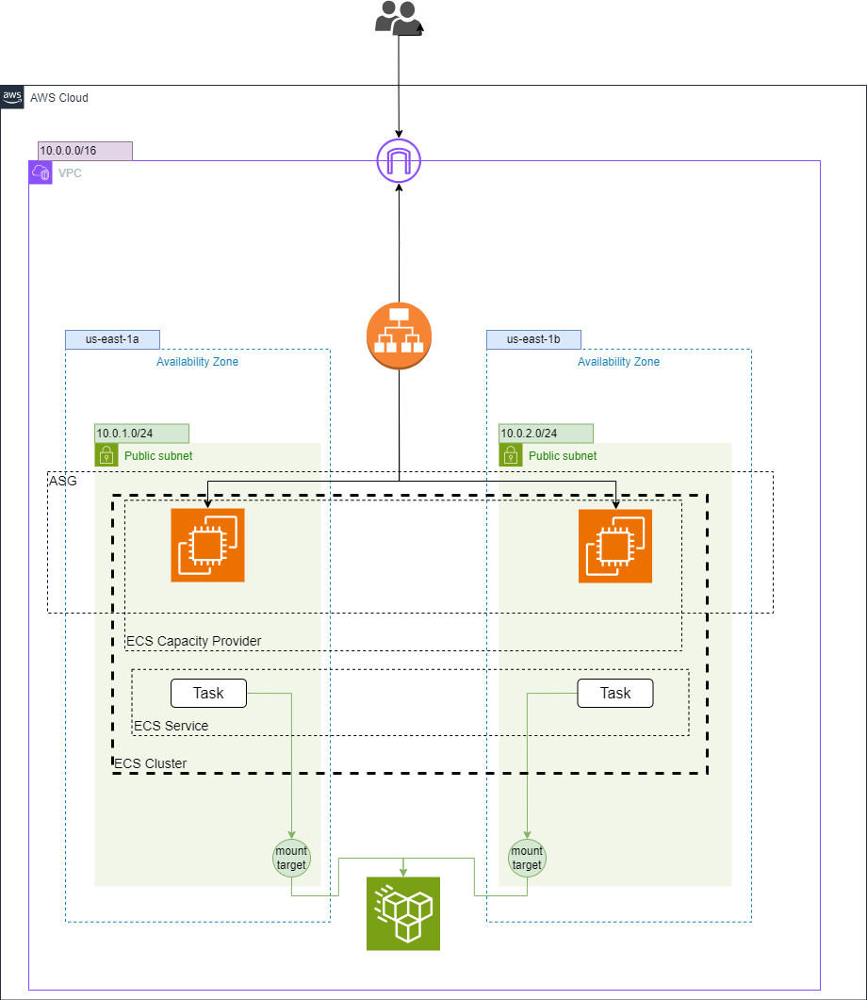

# ECS EC2 with EFS using Terraform

## Table of Contents
- [ECS EC2 with EFS using Terraform](#ecs-ec2-with-efs-using-terraform)
  - [Table of Contents](#table-of-contents)
  - [Introduction](#introduction)
  - [Prerequisites](#prerequisites)
  - [Architecture Overview](#architecture-overview)
  - [Modules](#modules)
    - [VPC](#vpc)
    - [Security Groups](#security-groups)
    - [ECR](#ecr)
    - [ECS Cluster](#ecs-cluster)
    - [ECS Task Definition](#ecs-task-definition)
    - [ECS Service](#ecs-service)
    - [Elastic File System (EFS)](#elastic-file-system-efs)
    - [Application Load Balancer (ALB)](#application-load-balancer-alb)
    - [Auto Scaling Group (ASG)](#auto-scaling-group-asg)
    - [IAM Roles](#iam-roles)
    - [CloudWatch Logs](#cloudwatch-logs)
  - [Setup Instructions](#setup-instructions)
    - [Clone the Repository](#clone-the-repository)
    - [Configure AWS CLI](#configure-aws-cli)
    - [Initialize Terraform](#initialize-terraform)
    - [Apply Terraform Configuration](#apply-terraform-configuration)
    - [Outputs](#outputs)
    - [Cleanup](#cleanup)

## Introduction

This project sets up an ECS cluster with EC2 instances to run an Nginx server, including an Application Load Balancer (ALB), Elastic File System (EFS) for persistent storage, and monitoring using CloudWatch Logs. The infrastructure is managed using Terraform.

## Prerequisites

Before you begin, ensure you have the following:

- [Terraform](https://www.terraform.io/downloads.html) installed
- [AWS CLI](https://aws.amazon.com/cli/) installed and configured
- An AWS account with necessary permissions to create resources

## Architecture Overview

The architecture includes the following components:

1. **VPC**: A Virtual Private Cloud for networking.
2. **Security Groups**: Define access rules for the ECS tasks, ALB, and EFS.
3. **Elastic Container Registry**: A private ECR repository for storing Docker images.
4. **ECS Cluster**: Manages the deployment of the ECS services.
5. **ECS Task Definition**: Defines the Docker container settings, including the use of a sidecar container to monitor EFS mount status.
6. **ECS Service**: Deploys the Docker container across multiple availability zones for high availability.
7. **Elastic File System (EFS)**: Provides shared file storage for the ECS tasks.
8. **Application Load Balancer (ALB)**: Distributes incoming traffic to the ECS tasks and provides health checks.
9. **Auto Scaling Group (ASG)**: Ensures the ECS instances can scale out and in based on load.
10. **IAM Roles**: Provide necessary permissions for ECS tasks and services.
11. **CloudWatch Logs**: Captures and stores logs from the ECS tasks for monitoring purposes.



## Modules

### VPC

The VPC module provisions:

- A VPC with a specified CIDR block
- Public subnets across multiple availability zones
- An Internet Gateway
- Route tables and associations for proper routing

### Security Groups

The Security Group module sets up security groups for:

- ECS tasks: Allows HTTP (port 80) traffic.
- EFS: Allows NFS traffic from the ECS tasks.
- ALB: Allows inbound HTTP traffic from the internet.
- EC2 instances: Allows inbound traffic on necessary ports for the ECS tasks.

### ECR

The ECR module provisions:

- A private ECR repository for storing Docker images.
- Necessary IAM permissions for pushing and pulling images from the repository.

After deploying the infrastructure, follow these steps to push your Docker image to ECR:

1. Authenticate Docker to your ECR registry:
```bash
aws ecr get-login-password --region your-region | docker login --username AWS --password-stdin <REPO_URL>
```

2. Build your Docker image:
```bash
docker build -t <your-repository-name> .
```

3. Tag your Docker image:
```bash
docker tag <your-repository-name>:latest <REPO_URL>:latest
```

4. Push your Docker image to ECR:
```bash
docker push <REPO_URL>:latest
```

### ECS Cluster

The ECS Cluster module creates an ECS cluster to manage the containerized applications.

### ECS Task Definition

The ECS Task Definition module defines the task with:

- A custom Docker image
- CPU and memory settings
- An EFS volume configuration for shared storage
- Container settings for the main application

### ECS Service

The ECS Service module deploys the task definition as a service in the ECS cluster, managing the desired count of tasks and ensuring high availability.

### Elastic File System (EFS)

The EFS module provisions:

- An EFS file system for shared persistent storage
- Mount targets in each private subnet for the ECS tasks

### Application Load Balancer (ALB)

The ALB module provisions:

- An Application Load Balancer to distribute traffic
- A target group for routing traffic to the ECS tasks
- A listener to handle incoming HTTP requests

### Auto Scaling Group (ASG)

The ASG module ensures:

- EC2 instances can scale out and in based on the load
- Proper configuration for ECS instances to join the ECS cluster

### IAM Roles

The IAM Roles module provisions:

- Roles and policies for the ECS tasks and services
- Necessary permissions for accessing EFS, CloudWatch Logs, and other AWS services

### CloudWatch Logs

The CloudWatch Logs module captures logs from the ECS tasks.

## Setup Instructions

### Clone the Repository

Clone the repository to your local machine:

```sh
git clone https://github.com/ameerahaider/Cloudelligent-Tasks.git
```

```sh
cd Task6
```

### Configure AWS CLI

Ensure your AWS CLI is configured with the necessary profile:

```sh
aws configure
```

### Initialize Terraform

Initialize Terraform in your project directory:

```sh
terraform init
```

### Apply Terraform Configuration

Deploy the infrastructure:

```sh
terraform apply
```

Confirm the changes by typing 'yes' when prompted.

### Outputs
After the deployment, Terraform will output:
- The DNS name of the ALB
- The ECR repository URL

### Cleanup

To destroy the resources created by Terraform, run:

```sh
terraform destroy
```

Type 'yes' when prompted to confirm the destruction.