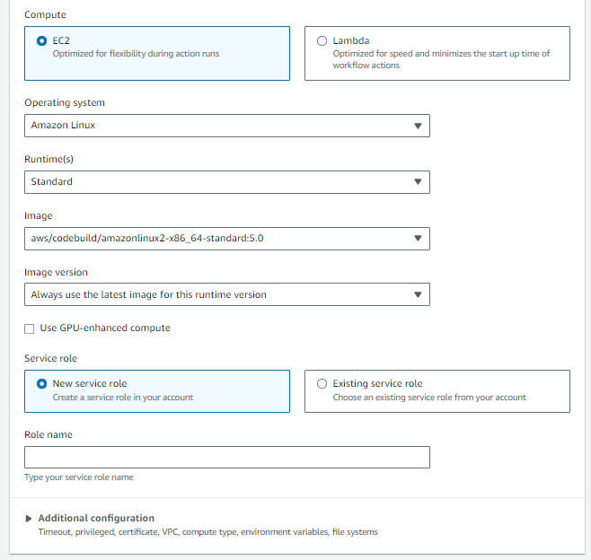
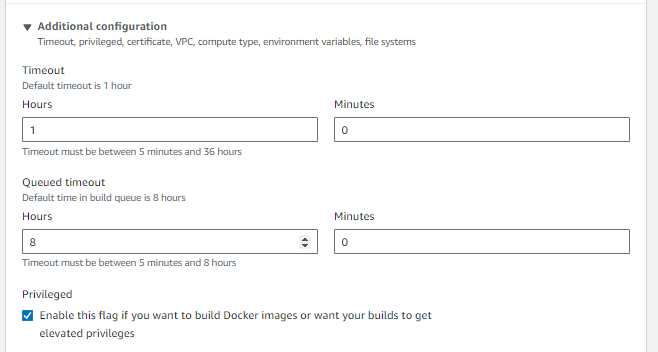

## Deploying the Application using AWS CodePipeline manually

### Introduction

After setting up the ECS cluster, EFS, and related infrastructure using Terraform, the next step is to automate the deployment of your application. Manual deployments can be error-prone and time-consuming, especially in complex environments. By using AWS CodePipeline, we can streamline the deployment process, ensuring consistent, repeatable, and automated updates to your application running on ECS. This guide will walk you through the process of setting up AWS CodePipeline for continuous integration and deployment (CI/CD) of your application which is already up and running on ECS. 

### Prerequisites

Before proceeding, ensure the following:

- The ECS infrastructure has been deployed using Terraform to  ensures that your environment is ready to host the application.
- The application code is hosted in a GitHub repository. CodePipeline will pull the latest code from this repository to build and deploy.

### Step-by-Step Guide

#### 1. Add a Build Specification File (`buildspec.yml`)

A `buildspec.yml` file is necessary for AWS CodeBuild to understand how to build and package your application. It tells AWS CodeBuild how to build and package your application. Without this file, CodeBuild would have no instructions on how to compile your application, build a Docker image, or push that image to a container registry. Place this file in the root of your source code repository.

Here’s an example `buildspec.yml` file:

```yaml
    version: 0.2

    env:
    variables:
        AWS_REGION: ""                  
        AWS_ACCOUNT_ID: ""      
        REPO_NAME: ""   # e.g., ECR Repo Name
        IMAGE_TAG: ""   # usually Lastest
        ecs_container_name: ""

    phases:
    pre_build:
        commands:
        - echo Logging in to Amazon ECR...
        - aws ecr get-login-password --region $AWS_REGION | docker login --username AWS --password-stdin $AWS_ACCOUNT_ID.dkr.ecr.$AWS_REGION.amazonaws.com
    build:
        commands:
        - echo Build started on `date`
        - echo Building the Docker image...
        - docker build -t $REPO_NAME .
        - docker tag $REPO_NAME:$IMAGE_TAG $AWS_ACCOUNT_ID.dkr.ecr.$AWS_REGION.amazonaws.com/$REPO_NAME:$IMAGE_TAG
    post_build:
        commands:
        - echo Pushing the Docker image...
        - docker push $AWS_ACCOUNT_ID.dkr.ecr.$AWS_REGION.amazonaws.com/$REPO_NAME:$IMAGE_TAG
        - echo Build completed on `date`
        - echo Writing image definitions file...
        - printf '[{"name":"'$ecs_container_name'","imageUri":"%s"}]' $AWS_ACCOUNT_ID.dkr.ecr.$AWS_REGION.amazonaws.com/$REPO_NAME:$IMAGE_TAG > imagedefinitions.json


    artifacts:
        files: imagedefinitions.json
```
  - Environment Variables: 
  These are placeholders for important values such as AWS region, account ID, repository name, ECS container name and the image tag. By using variables, you make your script more flexible and easier to reuse in different environments.

  - Phases: The build process is divided into phases:

    - Pre-build: This phase handles logging into the Amazon Elastic Container Registry (ECR), which is necessary to push Docker images.

    - Build: This is where the actual Docker image is built and tagged.
      
    - Post-build: Here, the image is pushed to ECR, and an image definition file is created. This file is used by ECS to understand which image to pull and run.
    
  - Artifacts: The image definition file, generated during the post-build phase, is a JSON file that contains the name of the ECS container and the URI of the Docker image in Amazon ECR. It is crucial because it tells AWS ECS which container to update and which image to pull during deployment. By passing this file as an artifact to the deploy stage, CodePipeline ensures that the correct and up-to-date Docker image is deployed to your ECS cluster, maintaining consistency and reliability in your application deployments.

#### 2. Create a New CodePipeline

##### 1. Access CodePipeline:
   
   You need to create a pipeline that will automate the build, test, and deployment of your application.

   - Go to the AWS Management Console and navigate to CodePipeline.
   - Click on Create Pipeline.

##### 2. Pipeline Settings:
   
   You need to define basic settings like the pipeline name and service role. The service role allows CodePipeline to interact with other AWS services on your behalf.

   - Name your pipeline.
   - For the service role, choose New service role if none exists.
   - Click Next.
   - 

##### 3. Source Provider: GitHub:
   
   CodePipeline needs to know where your source code is stored. GitHub is one of the most popular source control platforms.

   - Select GitHub Version 2 as the source provider.
   - Connect your GitHub account and select the appropriate repository and branch.
   - Set Trigger Type to No Filter for now
   - Leave the other settings as default and click Next.
   - 
   - 

##### 4. Build Stage: AWS CodeBuild:
   
   This stage defines how your application will be built. AWS CodeBuild will execute the instructions in your buildspec.yml file to create a Docker image of your application.

   - Select AWS CodeBuild as the build provider.
   - Click on Create project to configure a new CodeBuild project.
   - Environment Settings:
     - Operating System: Amazon Linux 2
     - Runtime: Standard
     - Image: aws/codebuild/amazonlinux2-x86_64-standard:3.0
     - Privileged: In Advanced Configurations ensure this checkbox is selected to allow Docker commands to run.
     - Service Role: Choose New service role if not already created.
     - 
     - 
     - 
  
   - Build Specification:

     - Ensure the Insert build commands checkbox is un checked 
     - Click Continue to CodePipeline.
     - 

##### 5. Deploy Stage: Amazon ECS:
   
   This stage is where your newly built Docker image is deployed to your ECS cluster. By using Amazon ECS as the deploy provider, CodePipeline will automatically update your ECS service with the new image.

   -  Select Amazon ECS as the deploy provider.
   - Choose the ECS cluster and service name created by - Terraform.
   - Ensure that the image definition file name matches the - artifacts file name in buildspec.yml.
   - Click Next.
   - 

##### 6. Review and Create:
   - Review your pipeline configuration.
   - Click Create Pipeline to finalize the setup.
   - 
  
##### 7. Ensuring Proper IAM Permissions for CodeBuild to Access Amazon ECR

   To ensure your AWS CodeBuild project can successfully authenticate with Amazon ECR and avoid permission issues, you need to update the IAM role associated with your CodeBuild project to grant it the necessary permissions. Follow these steps:

   - Identify and Update the IAM Role for CodeBuild:
   - Go to the AWS CodeBuild console, find your build project, and note the IAM role listed under Service role.
   - Navigate to the IAM console, select Roles, and find the noted IAM role.
   - Attach the necessary policy (e.g., AmazonEC2ContainerRegistryPowerUser) or manually update the policy to include permissions like ecr:GetAuthorizationToken.
  
#### 3. Test the Pipeline

   - Push a change to your GitHub repository.
   - The CodePipeline should trigger automatically, building the Docker image and deploying it to your ECS cluster.
   - 
   - 

### Cleanup
To clean up the resources, follow these steps:
1. Delete the CodePipeline:
   - Go to the AWS CodePipeline console.
   - Select the pipeline and delete it.

2. Destroy Terraform Resources:
    Run the following command in your Terraform project directory:
    
    ```bash
    terraform destroy
    ```
   - Confirm the changes by typing 'yes' when prompted.