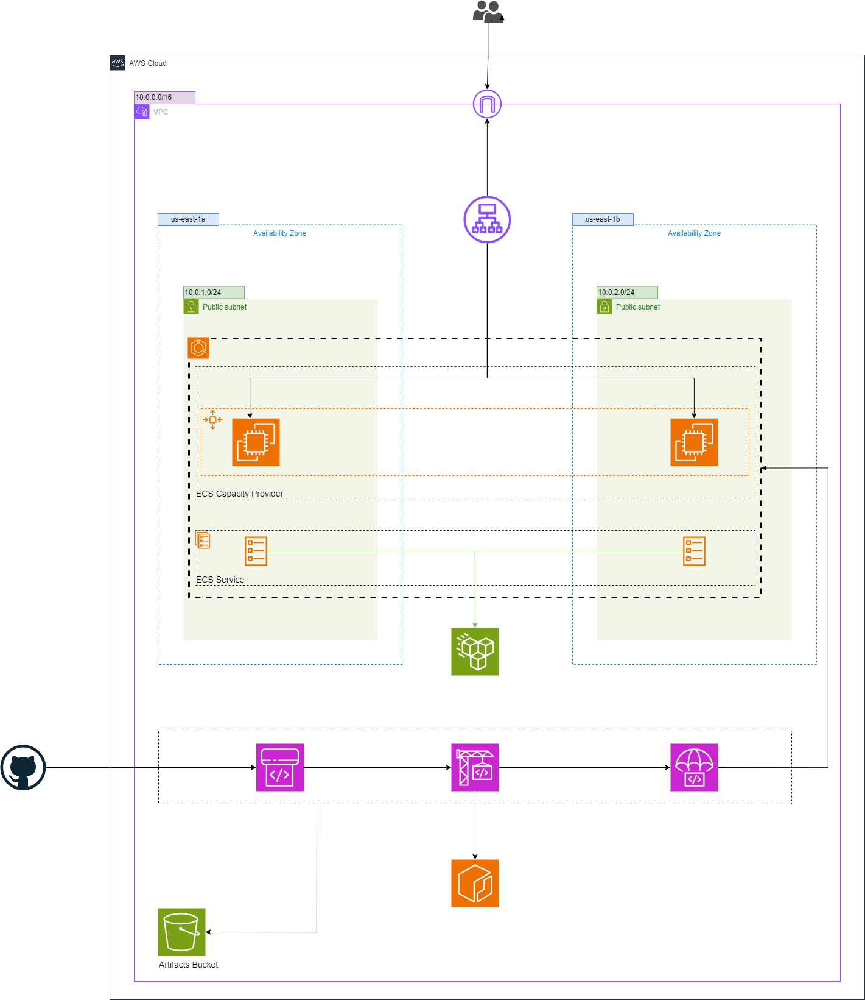

# Deploying an Application using AWS CodePipeline on ECS EC2 using Terraform

## Introduction

This project sets up an ECS cluster with EC2 instances to run an application, including an Application Load Balancer (ALB), Elastic File System (EFS) for persistent storage, and monitoring using CloudWatch Logs. After setting up the ECS cluster, EFS, and related infrastructure using Terraform, the next step is to automate the deployment of your application. This project sets up AWS CodePipeline for continuous integration and deployment (CI/CD) of your application which is already up and running on ECS. The infrastructure is managed using Terraform.

## Prerequisites

Before you begin, ensure you have the following:

- [Terraform](https://www.terraform.io/downloads.html) installed
- [AWS CLI](https://aws.amazon.com/cli/) installed and configured
- An AWS account with necessary permissions to create resources
- The application code is hosted in a GitHub repository.
- A `buildspec.yml` file is added to the root of the application specifying how to build and package your application. 
- Generate a GitHub Personal Access Token:
  - Go to Settings > Developer settings > Personal access tokens on GitHub.
  - Click Generate new token.
  - Save the token securely.
- Store the Token in AWS Secrets Manager:
  - Log in to the AWS Management Console.
  - Navigate to AWS Secrets Manager and click Store a new secret.
  - Choose Other type of secret and enter GITHUB_OAUTH_TOKEN as the key and your token as the value.
  - Name the secret (e.g., github-oauth-token) and click Store.

## Architecture Overview

The architecture includes the following components:

1. **VPC**: A Virtual Private Cloud for networking.
2. **Security Groups**: Define access rules for the ECS tasks, ALB, and EFS.
3. **Elastic Container Registry**: A private ECR repository for storing Docker images.
4. **ECS Cluster**: Manages the deployment of the ECS services.
5. **ECS Task Definition**: Defines the Docker container settings, including the use of a sidecar container to monitor EFS mount status.
6. **ECS Service**: Deploys the Docker container across multiple availability zones for high availability.
7. **Elastic File System (EFS)**: Provides shared file storage for the ECS tasks.
8. **Application Load Balancer (ALB)**: Distributes incoming traffic to the ECS tasks and provides health checks.
9. **Auto Scaling Group (ASG)**: Ensures the ECS instances can scale out and in based on load.
10. **IAM Roles**: Provide necessary permissions for ECS tasks, services, Code Build and Code Pipline.
11. **CloudWatch Logs**: Captures and stores logs from the ECS tasks for monitoring purposes.
12. **S3 Bucket**: Stores the input and output artifacts from the CodePipeline.
13. **Code Build**: Defines the build stage of the pipeline.
14. **Code Pipeline**: Creates a pipeline that will automate the build, and deployment of your application.
    


## Modules

### VPC

The VPC module provisions:

- A VPC with a specified CIDR block
- Public subnets across multiple availability zones
- An Internet Gateway
- Route tables and associations for proper routing

### Security Groups

The Security Group module sets up security groups for:

- ECS tasks: Allows HTTP (port 80) traffic.
- EFS: Allows NFS traffic from the ECS tasks.
- ALB: Allows inbound HTTP traffic from the internet.
- EC2 instances: Allows inbound traffic on necessary ports for the ECS tasks.

### ECR

The ECR module provisions:

- A private ECR repository for storing Docker images.
- Necessary IAM permissions for pushing and pulling images from the repository.

### ECS Cluster

The ECS Cluster module creates an ECS cluster to manage the containerized applications.

### ECS Task Definition

The ECS Task Definition module defines the task with:

- A custom Docker image
- CPU and memory settings
- An EFS volume configuration for shared storage
- Container settings for the main application

### ECS Service

The ECS Service module deploys the task definition as a service in the ECS cluster, managing the desired count of tasks and ensuring high availability.

### Elastic File System (EFS)

The EFS module provisions:

- An EFS file system for shared persistent storage
- Mount targets in each private subnet for the ECS tasks

### Application Load Balancer (ALB)

The ALB module provisions:

- An Application Load Balancer to distribute traffic
- A target group for routing traffic to the ECS tasks
- A listener to handle incoming HTTP requests

### Auto Scaling Group (ASG)

The ASG module ensures:

- EC2 instances can scale out and in based on the load
- Proper configuration for ECS instances to join the ECS cluster

### IAM Roles

The IAM Roles module provisions:

- Roles and policies for the ECS tasks and services
- Necessary permissions for accessing EFS, CloudWatch Logs, and other AWS services

### CloudWatch Logs

The CloudWatch Logs module captures logs from the ECS tasks.

### S3 Bucket
The S3 bucket module provisions:

- Storage for build artifacts produced by CodeBuild and consumed by CodePipeline.
- Policies and permissions to allow CodePipeline and CodeBuild to read from and write to the bucket.

### IAM Code Build

The IAM Code Build module provisions:

- Roles and policies for AWS CodeBuild to interact with other AWS services such as ECR (Elastic Container Registry), S3, and CloudWatch Logs.
- Access to push and pull images from ECR.
- Permissions to read/write to S3 buckets used for storing artifacts.
- Access to create and manage logs in CloudWatch.

### IAM Code Pipeline

The IAM Code Pipeline module provisions:

- Roles and policies for AWS CodePipeline to access resources needed for the pipeline stages.
- Access to S3 buckets for reading and writing artifacts.
- Permissions to interact with CodeBuild for triggering builds.
- Access to other services such as ECS for deploying the application.

### Code Build

The Code Pipeline module provisions:

- The build project of the pipeline.
- It pulls the source code, runs the build commands, and produces build artifacts.
- Configured to build specifications (buildspec) to define the build commands and environment.
  
### Code Pipeline

The Code Pipeline module provisions:

- A pipeline which automates the deployment process by integrating various stages such as source, build, and deploy.
- Source: Retrieves your code from a source repository (e.g., GitHub).
- Build: Uses AWS CodeBuild to compile the code and create deployable artifacts.
- Deploy: Deploys the artifacts to your ECS cluster.

## Setup Instructions

### Clone the Repository

Clone the repository to your local machine:

```sh
git clone https://github.com/ameerahaider/Cloudelligent-Tasks.git
```

```sh
cd Task8
```

### Configure AWS CLI

Ensure your AWS CLI is configured with the necessary profile:

```sh
aws configure
```

### Initialize Terraform

Initialize Terraform in your project directory:

```sh
terraform init
```

### Apply Terraform Configuration

Deploy the infrastructure:

```sh
terraform apply
```

Confirm the changes by typing 'yes' when prompted.

### Outputs
After the deployment, Terraform will output:
- The DNS name of the ALB
- The ECR repository URL

### Cleanup

To destroy the resources created by Terraform, run:

```sh
terraform destroy
```

Type 'yes' when prompted to confirm the destruction.