# Deploying a Simple Node.js Application on AWS Elastic Beanstalk

This guide will walk you through the process of deploying a simple Node.js application to AWS Elastic Beanstalk using the AWS Management Console. Follow these steps to get your application up and running.

## Prerequisites

- An AWS account
- Node.js and npm installed locally
- Git installed locally

## Steps

### 1. Clone the GitHub Repository

First, clone the GitHub repository that contains your simple Node.js application.

```bash
git clone https://github.com/ameerahaider/Cloudelligent-Tasks.git

cd Task8\simple-nodejs-app
```

### 2. Install Dependencies
Navigate to the project directory and install the necessary dependencies using npm.

```bash
npm install
```

### 3. Run the Application Locally
Start your Node.js application locally to ensure it works as expected.

```bash
npm start
```

Visit http://localhost:3000 (or the port specified in your application) to verify that the application is running correctly.

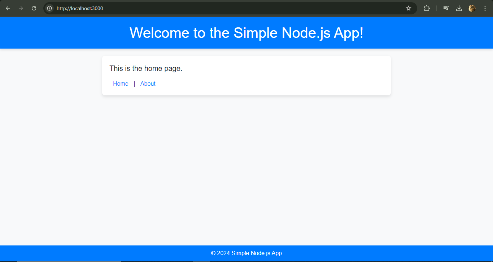

### 4. Prepare the Application for Deployment
Compress your application files into a ZIP archive for uploading to Elastic Beanstalk.

```bash
zip -r simple-nodejs-app.zip .
```

### 5. Deploy to AWS Elastic Beanstalk
#### Open AWS Elastic Beanstalk Console
1. Log in to the AWS Management Console.
2. Navigate to the Elastic Beanstalk service.

#### Create a New Application
1. Click on Create Application.
2. Enter a name for your application, e.g., simple-nodejs-app.

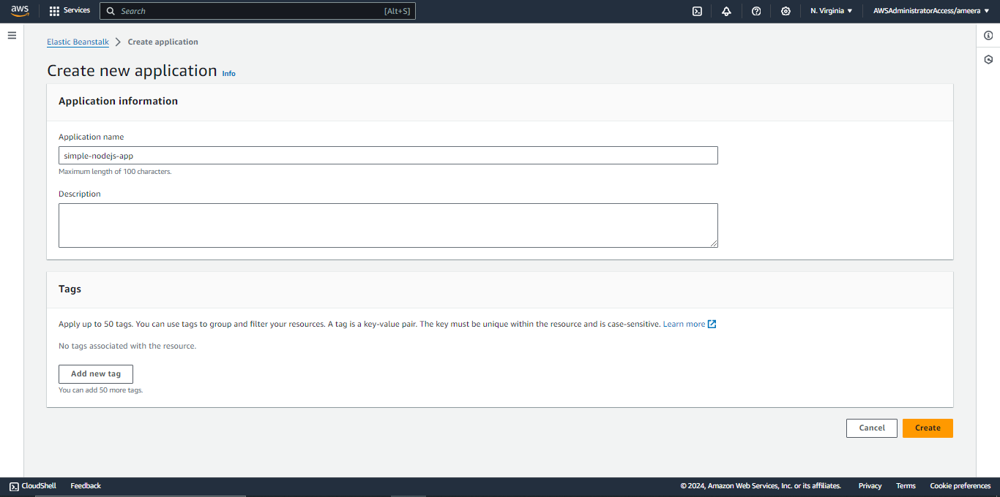
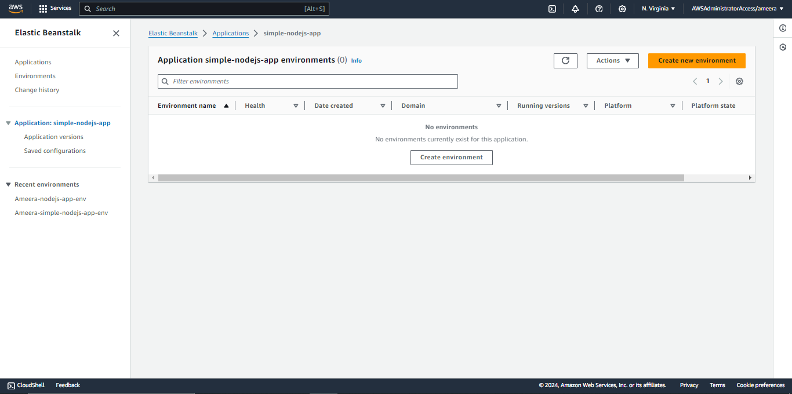

#### Create new Enviroment
1. Click on Create new Enviroment.
2. Enter a name for your enviroment, e.g., simple-nodejs-app-env.

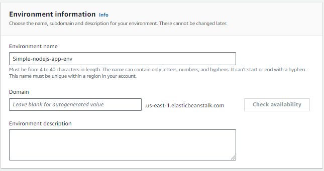

#### Configure Application Settings
1. Platform: Choose Node.js.
2. Platform Branch: Select the appropriate Node.js version (e.g., Node.js 18 running on 64bit Amazon Linux 2).
3. Platform Version: Choose the latest available version compatible with your app.

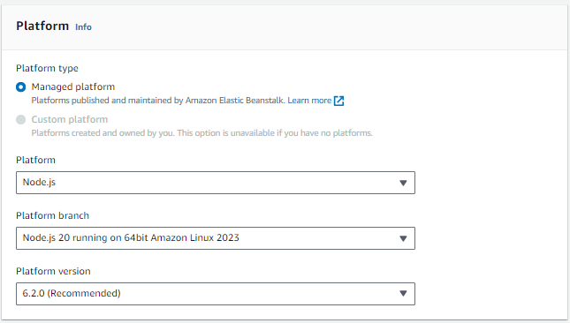

#### Upload Your Code
1. In the Source code origin section, select Local file.
2. Click Choose file and select the simple-nodejs-app.zip file you created earlier.

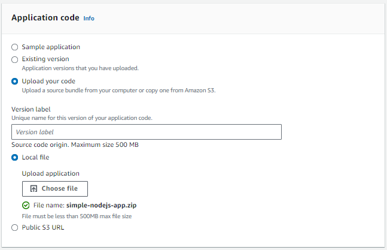

#### Configure Environment
1. Select the configuration preset Single Instance.
2. Choose IAM to use an existing IAM role if necessary.

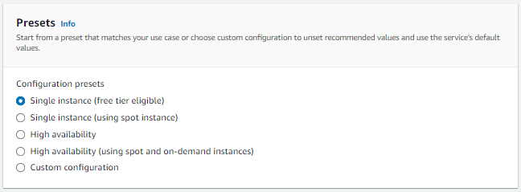
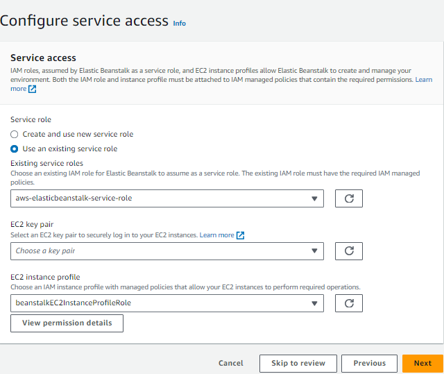

####  Create the Application
1. Leave everything else as Default.
2. Click Create application to start the deployment process.

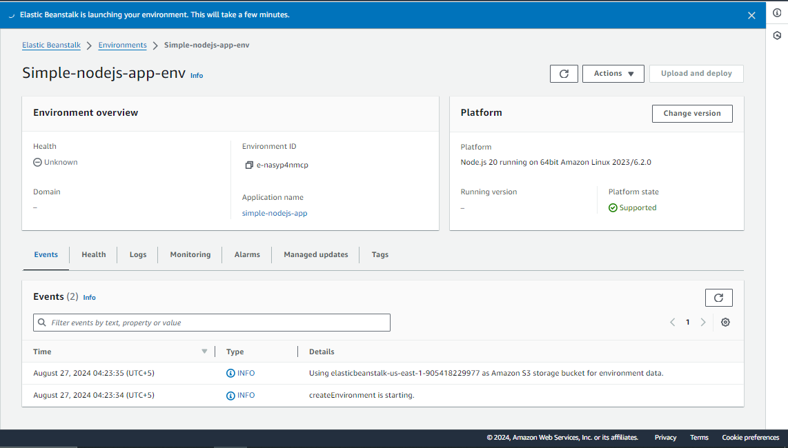

### 6. Monitor Deployment Progress
You can track the deployment progress in the CloudFormation console or the Elastic Beanstalk console.

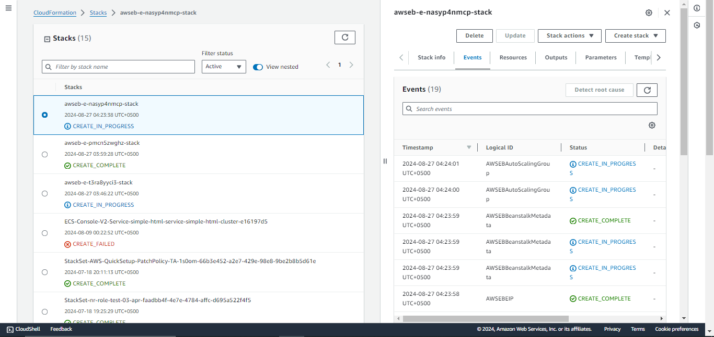

### 7. Access Your Application
Once the deployment is complete, you will receive a public domain name for your application. Open the provided URL in your web browser to see your application running live.

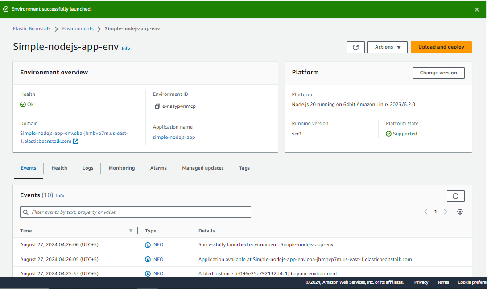
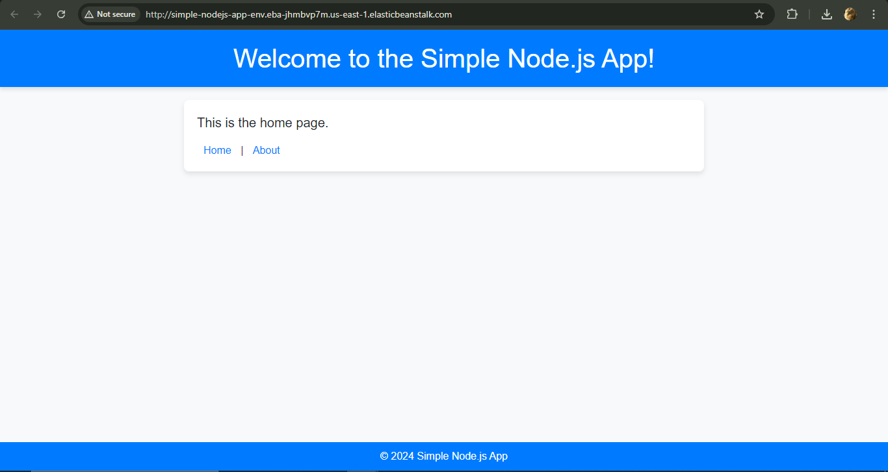